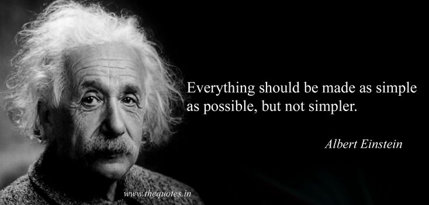

## Agenda

<v-clicks depth="2">

- Scala, a complex language  ?
- 10s demo time / 2 lines of shell:
  - scaffolding and IDE magic.
  - End ~~User~~ Developer  Experience.
- Programming with Type:
  - Scala type system. 
  - UI Laminar form derivation.
- Programming with values:
  - Tapir: HTTP client.
  - Effects system: ZIO
- Deployment
  - Docker, Kubernetes, ArgoCD

</v-clicks>

::right::

<!--

 - ZIO is central to the architecture:
    - the glue between the layers.
    - orchestrating the side effects.

-->
