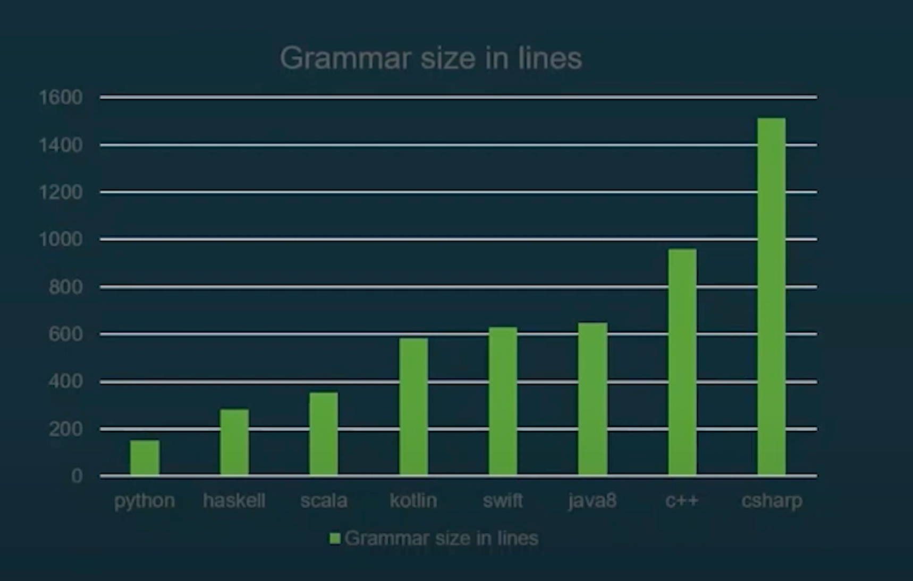

# Scala Complexity

---

## Scala Complexity / Language ?

Not the language !



---

## Scala Complexity / Syntax ?

````md magic-move {lines: true}
```scala
// Not the Syntax !
def helloWorld = println("Hello, World!")
```
```scala
// Not the execution !
@main
def helloWorld = println("Hello, World!")
```
```bash
scala helloWorld.scala
```
```bash
#!/usr/bin/env -S scala-cli -S 3

println("Hello, World!")
```
````

---

## Scala Complexity / Mythos

Then why this rumor ?

<v-clicks>

- Type system
- Implicits
- Higher-kinded types
- Type classes

</v-clicks>
