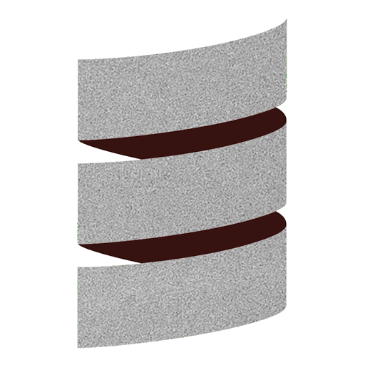

# Scala Full Stack the easy way

## Why this talk?

<div grid="~ cols-[50%_50%] gap-1">
  <div>
    <ul style="margin-top:1em">
      <li v-click="+1">In&nbsp; ❤️ with Web apps for 25+ years aka cgi-bin era</li>
      <li v-click="+2">In&nbsp; ❤️ with Scala for 12+ years</li>
      <li v-click="+3">In&nbsp; ❤️ with ScalaJs since v0.6</li>
      <li v-click="+4">In&nbsp; ❤️ with Effect system 5+ years</li>
    </ul>
   </div>
   <div v-click="+5">
     
    </div>
    <div style="margin-top:1em">
        <h2 v-click="+6">Yet in another dimension...</h2>
        <ul style="margin-top:1em">
            <li v-click="+7">Angular#, React, vus, ember ...</li>
            <li v-click="+8">npm, grunt, yarn ...</li>
        </ul>
    </div>
    <div>
      
    </div>
</div>


---

# Scala Full Stack ?


<div grid="~ cols-6 gap-1">
<div></div>
<div></div>
 <div v-click="+3">
  
 LLVM
 </div>
 <div></div>
 <div v-click="+4"></div>
 <div></div>
 <div></div>
 <div></div>
 <div v-click="+3">
  &nbsp;&nbsp; ↑
  <div style="margin-left:-25px;">Scala Native</div>
  &nbsp;&nbsp;&nbsp;⏐
 </div>
 <div>
 </div>
 <div  v-click="+5">
   &nbsp;&nbsp; ↑

  &nbsp;&nbsp;&nbsp;⏐
 </div> 
 <div></div> 
<div v-click="+1">
  
  Scala JVM
</div>
 <div v-click="+1">
<-- Scalac ---
 </div>
<div>
  
   Scala
</div>
 <div  v-click="+2">
 --- ScalaJS -->
  
 </div> 
 <div v-click="+5">SJIR &nbsp;&nbsp;  ---></div>
<div v-click="+2">
  
  
</div>
<div></div><div></div><div></div>
</div>

<!-- 

Scala is a language that can be compiled to:

* the JVM
* to JavaScript targeting both Node and the browser
* to LLVM
* to WASM (experimental)
 -->


---

# ZIO Rite of Passage

From Rock the JVM.

<div grid="~ cols-[30%_70%] gap-4">
  <div>
    <ul>
      <li v-click>Scala Backend</li>
      <li v-click>ScalaJs</li>
      <li v-click>ZIO, Tapir, Laminar</li>
      <li v-click>Postgres, ChatGPT, Stripe</li>
    </ul>
  </div>
  <div>
    
  </div>
  <div>
    <span v-click>Few weeks later...</span>
    
  </div>
  <div v-click>

````md magic-move {at: 8}
```
The good: 
The bad:
The Ugly:
```
```
The good: 
  - DX awesome, feedback loop
  - Integration: UI, Effect System, HTTP client/server
The bad:
The Ugly:
```
```
The good: 
  - DX awesome, feedback loop
  - Integration: UI, Effect System, HTTP client/server
The bad:
  - Integration: Quite a few lines of code
The Ugly:
```
```
The good: 
  - DX awesome, feedback loop
  - Integration: UI, Effect System, HTTP client/server
The bad:
  - Integration: Quite a few lines of code
The Ugly:
  - Setup a new project
  - Start development environment
```
````
  </div>
</div>


<!--

Rock the JVM, not only ... JS too.

But ...

* tedious setup
* painful to start dev environment:
  * sbt X 2
  * vite
  * docker


 -->


