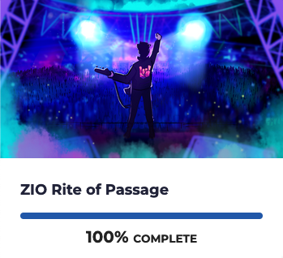

# Scala Full Stack the easy way

## Why this talk?

<div grid="~ cols-[50%_50%] gap-1">
  <div>
    <ul style="margin-top:1em">
      <li v-click="+1">In&nbsp; ❤️ with Web apps for 25+ years aka cgi-bin era</li>
      <li v-click="+2">In&nbsp; ❤️ with Scala for 12+ years</li>
      <li v-click="+3">In&nbsp; ❤️ with ScalaJs since v0.6</li>
      <li v-click="+4">In&nbsp; ❤️ with Effect system 5+ years</li>
    </ul>
   </div>
   <div v-click="+5">
     
    </div>
    <div style="margin-top:1em">
        <h2 v-click="+6">Yet in another dimension...</h2>
        <ul style="margin-top:1em">
            <li v-click="+7">Angular#, React, vus, ember ...</li>
            <li v-click="+8">npm, grunt, yarn ...</li>
        </ul>
    </div>
    <div>
      
    </div>
</div>


---

# ZIO Rite of Passage

From Rock the JVM.

<div grid="~ cols-2 gap-4">
  <div>
    <ul>
      <li v-click>Scala Backend</li>
      <li v-click>ScalaJs</li>
      <li v-click>ZIO, Tapir, Laminar</li>
      <li v-click>Postgres, ChatGPT, Stripe</li>
    </ul>
  </div>
  <div>
    
  </div>
  <div>
    <span v-click>Few weeks later...</span>
    
  </div>
  <div v-click>

```
The good: 
  - DX awesome, feedback loop
  - Integration: ZIO, Tapir and Laminar libraries
The bad:
  - Integration: Quite a few lines of code.
The Ugly:
  - Setup a new project
  - Start development environment
```
  </div>
</div>

<!--

Rock the JVM, not only ... JS too.

But ...

* tedious setup
* painful to start dev environment:
  * sbt X 2
  * vite
  * docker


 -->


