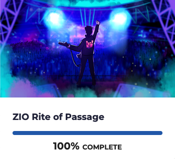

# Scala Full Stack the easy way

## Why this talk?

  

    <ul style="margin-top:1em">
      <li v-click="+1">I&nbsp; ❤️ Web apps for 25+ years aka cgi-bin era</li>
      <li v-click="+2">I&nbsp; ❤️ Scala for 12+ years</li>
      <li v-click="+3">I&nbsp; ❤️ ScalaJs since v0.6</li>
      <li v-click="+4">I&nbsp; ❤️ Effect system 5+ years</li>
    </ul>
   

   

     
    

    

        <h2 v-click="+6">Yet in another dimension...</h2>
        <ul style="margin-top:1em">
            <li v-click="+7">Angular#, React, vus, ember ...</li>
            <li v-click="+8">npm, grunt, yarn ...</li>
        </ul>
    

    

      
    

---

# ZIO Rite of Passage

From Rock the JVM.

  

    <ul>
      <li v-click="+1">Scala Backend</li>
      <li v-click="+2">ScalaJs</li>
      <li v-click="+3">ZIO, Tapir, Laminar</li>
      <li v-click="+4">Postgres, ChatGPT, Stripe</li>
    </ul>
  

  

    
  

  

    
  

  

    <ul>
      <li style="list-style-type: '❤️';" v-click="+7">Scala definitively Rocks the JVM</li>
      <li style="list-style-type: '😴';" v-click="+8">Setup new project</li>
      <li style="list-style-type: '😔';" v-click="+9">Starting dev environment</li>
    </ul>
  

