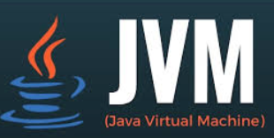

# Why this talk?

<div grid="~ cols-[50%_50%] gap-1">
  <div>
    <ul style="margin-top:1em">
      <li v-click="+1" delay="1s">In&nbsp; ❤️ with Web apps for 25+ years aka cgi-bin era</li>
      <li v-click="+1" delay="3s">In&nbsp; ❤️ with Scala for 12+ years</li>
      <li v-click="+1" delay="5s">In&nbsp; ❤️ with ScalaJs since v0.6</li>
      <li v-click="+1" delay="7s">In&nbsp; ❤️ with Effect system 5+ years</li>
    </ul>
   </div>
   <div v-click="+2">
     
    </div>
    <div style="margin-top:1em">
        <h2 v-click="+3">Yet in another dimension...</h2>
        <ul style="margin-top:1em">
            <li v-click="+3" delay="1s">Angular#, React, vus, ember ...</li>
            <li v-click="+3" delay="2s">npm, grunt, yarn ...</li>
        </ul>
    </div>
    <div>
      
    </div>
</div>

---

## Scala Full Stack, really ?

<br />

<div grid="~ cols-4 gap-1">
  <div></div>
  <div></div>
  <div></div>
  <div></div>
  <div>2003</div>
  <div>2014</div>
  <div>2017</div>
  <div>2024</div>
</div>


<!-- 

Scala is a language that can be compiled to:

* the JVM
* to JavaScript targeting both Node and the browser
* to LLVM then to binary
* to WASM (experimental)
 -->


---

## ZIO Rite of Passage

From Rock the JVM.

<div grid="~ cols-[30%_70%] gap-4">
  <div>
    <ul>
      <li v-click>Scala Backend</li>
      <li v-click>ScalaJs</li>
      <li v-click>ZIO, Tapir, Laminar</li>
      <li v-click>Postgres, ChatGPT, Stripe</li>
    </ul>
  </div>
  <div>
    
  </div>
  <div>
    <span v-click>Few weeks later...</span>
    
  </div>
  <div v-click>

````md magic-move {at: 8}
```
The good: 
The bad:
The Ugly:
```
```
The good: 
  - DX awesome, feedback loop
  - Integration: UI, Effect System, HTTP client/server
The bad:
The Ugly:
```
```
The good: 
  - DX awesome, feedback loop
  - Integration: UI, Effect System, HTTP client/server
The bad:
  - Integration: Quite a few lines of code
The Ugly:
```
```
The good: 
  - DX awesome, feedback loop
  - Integration: UI, Effect System, HTTP client/server
The bad:
  - Integration: Quite a few lines of code
The Ugly:
  - Setup a new project
  - Start development environment
```
```
The good: 
  - DX awesome, feedback loop
  - Integration: UI, Effect System, HTTP client/server
  👉 g8 scaffold  
  👉 VSCode automation
The bad:
  - Integration: Quite a few lines of code
The Ugly
```
```
All good: 
  - DX awesome, feedback loop
  - Integration libs: UI, Effect System, HTTP client/server
    👉 Tapir ZIO laminar integration
    👉 Laminar Forms derivation
  - g8 scaffold
  - VSCode automation
```
````
  
  </div>
</div>

<!--
Then Rock the JVM released a course on ZIO and I decided to follow it.

So good, so powerful, so expressive, so much fun.

But ...

* tedious setup
* painful to start dev environment:
  * sbt X 2
  * vite
  * docker

 -->

---

## Monolith 3-tiers architecture

<div grid="~ cols-[25%_50%_30%] gap-0">
  <div>

<div v-click>

  Frontend: SPA
</div>
<div v-click="+1">

- [ScalaJs](https://www.scala-js.org)
</div>
<div v-click="+2">
 
- [ZIO](https://zio.dev)
</div>
<div v-click="+3">

- [Sttp Tapir](https://tapir.softwaremill.com/en/latest/) REST client
<div v-click="+4">

- [Laminar](https://laminar.dev)
</div>
</div>

 </div>
  <div>
    
  </div>
  <div>

<div v-click="+1">


Backend:
</div>
<div v-click="+1">

  
- [Scala](https://www.scala-lang.org)
</div>
<div v-click="+2">

- [ZIO](https://zio.dev)
</div>
<div v-click="+3">

- [Tapir](https://tapir.softwaremill.com/en/latest/) REST API
</div>
<div v-click="+4">

- [Quill](https://getquill.io) SQL queries
</div>


<v-clicks at="4">

<br />

  Database:

- [Postgres](https://www.postgresql.org)
- [Flyway](https://github.com/flyway/flyway) migrations

</v-clicks>
 </div>

</div>

<!--

I started on my own a project to build a full stack app with Scala.

* Frontend: SPA
* Backend:
  * BFF
  * REST API
* Database: Postgres

-->