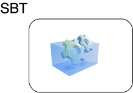

# Setup / SBT


## One project to rule them all


```scala {*|1-2|3-5|6-8|9-10|11-12|13-14}
// Cross project support, to spread project resources between js and jvm world
addSbtPlugin("org.portable-scala" % "sbt-scalajs-crossproject" % "1.3.2")
// Scala.js support
addSbtPlugin("org.scala-js" % "sbt-scalajs"        % "1.17.0")
addSbtPlugin("org.scala-js" % "sbt-jsdependencies" % "1.0.2")
// Scala.js bundler
addSbtPlugin("ch.epfl.scala" % "sbt-scalajs-bundler"     % "0.21.1")
addSbtPlugin("ch.epfl.scala" % "sbt-web-scalajs-bundler" % "0.21.1")
// TypeScript support
addSbtPlugin("org.scalablytyped.converter" % "sbt-converter" % "1.0.0-beta44")
// Static file generator
addSbtPlugin("org.playframework.twirl" % "sbt-twirl" % "2.0.5")
// Will reStart server on code modification.
addSbtPlugin("io.spray" % "sbt-revolver" % "0.10.0")
```

---

# Project Structure / SBT

<div grid="~ cols-3">
  <div></div>
  <div v-click="2">
    <h4>CrossProject shared</h4>
    
  </div>
  <div></div>
  <div>
    <h4>server</h4>
    
  </div>
  <div v-click="+3">
    </div>
  <div>
    <h4>client</h4>
    
  </div>
</div>


---


# SBT Cross Project

* plugins.sbt
```scala
addSbtPlugin("org.portable-scala" % "sbt-scalajs-crossproject" % "1.3.2")
```

* build.sbt
```scala {*|1|8-9}
lazy val shared: CrossProject = crossProject(JSPlatform, JVMPlatform)
  .crossType(CrossType.Pure)
  .disablePlugins(RevolverPlugin)
  .in(file("modules/shared"))
  /* [...] */
  .settings(publish / skip := true)
  
lazy val sharedJvm: Project = shared.jvm
lazy val sharedJs: Project  = shared.js
```

---

# SBT Cross Project
<h4>Shared</h4>

```scala
lazy val shared: CrossProject = crossProject(JSPlatform, JVMPlatform)
// [...]  
lazy val sharedJvm: Project = shared.jvm
lazy val sharedJs: Project  = shared.js
```

<div grid="~ cols-2 gap-4">
<div v-click="+1">
<h4>Server</h4>
```scala {*|3}{at:2}
lazy val server = project
  .settings( /* [...] */ )
  .dependsOn(sharedJvm)
```
</div>
<div v-click="+3">
<h4>Client</h4>
```scala {*|4}{at:4}
lazy val client = project
  .enablePlugins(ScalaJSPlugin)
  .settings( /* [...] */ )
  .dependsOn(sharedJs)
```
</div>
</div>

---

# Setup / Backend


---

### Setup / Frontend / NPM / package.json

```json {*|7-11,20-21|13-18}{lines:true}
{
  "name": "scalaZio-fullstack-demo",
  "private": true,
  "version": "0.0.1",
  "main": "index.js",
  "type": "module",
  "scripts": {
    "dev": "vite",
    "build": "vite build",
    "preview": "vite preview"
  },
  "license": "MIT",
  "dependencies": {
    "@ui5/webcomponents": "2.1.0",
    "@ui5/webcomponents-fiori": "2.1.0",
    "@ui5/webcomponents-icons": "2.1.0",
    "chart.js": "2.9.4"
  },
  "devDependencies": {
    "@scala-js/vite-plugin-scalajs": "^1.0.0",
    "vite": "^5.4.9",
    "typescript": "5.6.3",
    "@types/chart.js": "2.9.29"
  }
}
```


---

### Setup / Frontend / NPM / vite.config.js


```js {*|2|5|8|12}
import { defineConfig } from "vite";
import scalaJSPlugin from "@scala-js/vite-plugin-scalajs";

export default defineConfig({
    plugins: [scalaJSPlugin({
        // path to the directory containing the sbt build
        // default: '.'
        cwd: '../..',

        // sbt project ID from within the sbt build to get fast/fullLinkJS from
        // default: the root project of the sbt build
        projectID: 'client',

        // URI prefix of imports that this plugin catches (without the trailing ':')
        // default: 'scalajs' (so the plugin recognizes URIs starting with 'scalajs:')
        uriPrefix: 'scalajs',
    })],
    build: {
        sourcemap: true,
    }
});
```

---

# Setup / Frontend


