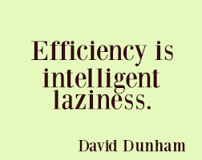

# Setup Full Stack

<v-clicks depth="3">

- Build tools
  - NPM
    - Node Package Manager.
    - <span v-mark="{type:'underline', color:'orange', at:6, delay:2000}">Vite: Hot reload of UI.</span>
  - SBT
    - <span v-mark="{type:'underline', color:'orange', at:6}">Scala JS</span>
    - Scala JVM
- Docker
- Kubernetes

</v-clicks>

::right::

<div grid="~ cols-2">
<div>
 
</div>
<div>
 <div></div>
 
</div>
</div>

---
transition: fade
layout: two-cols
---

## 10s demo

Dozen of tools to setup ... 

<v-clicks>

- Docker
  - compose
- Kubernetes
  - ArgoCD
  - Kustomize
- SBT
  - scala
  - ScalaJS
- NPM
  - Vite
  - ScalaJS plugin  

</v-clicks>

::right::

<div v-click>
package.json, vite.config.js, build.sbt, plugins.sbt, Dockerfile, Kubernetes, ...
</div>

<v-clicks depth="1">

- 15 files ...
- 1000 lines of code/config
</v-clicks>


---

## One line ( 1/2 ) :  setup a new project



<div  v-click>Let's automate it with a template
```bash
sbt new cheleb/zio-scalajs-laminar.g8 --name=scala-at-sunnytech
```
</div>

<div v-click>
Or with K8S / ArgoCD support.

```bash
sbt new cheleb/zio-scalajs-laminar.g8  --name=scala-at-sunnytech-k8s\
                                       --githubUser=cheleb --with-argocd=true\
                                       --force
```

</div>

---

## One line ( 2/2 ): Go to work

<div grid="~ cols-2">

 <div>
  <div v-click>
   <div style="float: left">
    <p> Docker</p>
    <div>
     
   </div>
  </div>
   
 </div>
</div>
 <div>
  <div v-click>
   <div style="float: left">
    <p> Scala</p>
    <div>
     
   </div>
  </div>
   
 </div>
</div>

 <div>
  <div v-click>
  <div style="float: left">
    <p> ScalaJS</p>
   <div>
    
   </div>
  </div>
   
 </div>
</div>

 <div>
  <div v-click>
  <div style="float: left">
    <p>Vite</p>
   <div>
    
   </div>
  </div>
   
 </div>
</div>

</div>

<div  v-click>

```bash
code scala-at-sunnytech
```

</div>
<div v-click>
Or with K8S / ArgoCD support.
```bash
code scala-at-sunnytech-k8s
```

</div>

<!--

 Now we have a project with a fullstack setup.

 With a few commands, we can start the development environment.

 * sbt X 2 (backend, frontend)
 * vite
 * docker

Or just open the project in VSCode.

-->

---

## VSCode / Metals 🤘🏼

Task automation with <span v-mark="{type:'circle', color:'orange', at:1}">`.vscode/tasks.json`</span> and `launch.json`

````md magic-move {lines: true, at:2}
```json {*|7|9|11-12}
{
  "version": "2.0.0",
  "tasks": [
    {
       "label": "demo",
        "runOptions": {
            "runOn": "folderOpen"
        },
        "dependsOrder": "sequence",
        "dependsOn": [
            "setup",
            "runDemo"
        ],
        "problemMatcher": [],
        "group": {
            "kind": "build"
        }
    }
  ]
}
```

```json {*|4|8}
{
    "label": "setup",
    "type": "shell",
    "command": "./scripts/setup.sh",
    "presentation": {
        "panel": "dedicated",
        "group": "runDevCmd",
        "close": true
    },
    "group": "build"
}
```

```json {*|3|5-8}
{
    "label": "runDemo",
    "dependsOrder": "parallel",
    "dependsOn": [
        "docker",
        "serverRun",
        "fastLink",
        "npmDev"
    ],
    "problemMatcher": [],
    "group": {
        "kind": "build"
    }
},
```

````

<!--

Who wants to type the same commands over and over again?
Who knows about tasks.json in VSCode ?
  * Just a few lines of JSON to automate tasks.

When folder opens, run the setup script, then run the demo.

-->

---

## Project Structure / SBT

<div grid="~ cols-3">
  <div></div>
  <div v-click>
    
  </div>
  <div></div>
  <div>
    <h4>server</h4>
    
  </div>
  <div v-click>
    </div>
  <div>
    <h4>client</h4>
    
  </div>
</div>

<div v-click  style="position:absolute"  v-motion
  :initial="{ x: 0, y: -100 }"
  :enter="{ x: 160, y: -85 }"
  >
  
</div>

<!-- 

In the end we have a project structure with a backend and a frontend.

But how to share code between the two, after all, we are in the Scala ecosystem on both sides of the wire.

Here comes the SBT Cross Project.

This project element will only exist at compile time, it will not be published, but it will be casted to the JVM and JS projects.

The JVM project will depend on the shared project, and the JS project will depend on the shared project.

-->


---

## SBT Cross Project

<h4>Shared</h4>

```scala
lazy val shared: CrossProject = crossProject(JSPlatform, JVMPlatform)
// [...]  
lazy val sharedJvm: Project = shared.jvm
lazy val sharedJs: Project  = shared.js
```

<div grid="~ cols-2 gap-4">
<div v-click="+1">
<h4>Server</h4>
```scala {*|3}{at:2}
lazy val server = project
  .settings( /* [...] */ )
  .dependsOn(sharedJvm)
```
</div>
<div v-click="+3">
<h4>Client</h4>
```scala {*|4}{at:4}
lazy val client = project
  .enablePlugins(ScalaJSPlugin)
  .settings( /* [...] */ )
  .dependsOn(sharedJs)
```
</div>
</div>

<!--

This how we define the shared project in SBT. It is rather simple, we define a CrossProject that will be casted to the JVM and JS projects.

Add backends and frontends dependencies to the shared project variant according to the platform.

-->

---

## Setup / Frontend / NPM / package.json

```json {*|7-11,20-21}{lines:true}
{
  "name": "scala-at-sunnytech",
  "private": true,
  "version": "0.0.1",
  "main": "index.js",
  "type": "module",
  "scripts": {
    "dev": "vite",
    "build": "vite build",
    "preview": "vite preview"
  },
  "license": "MIT",
  "dependencies": {
    "@ui5/webcomponents": "2.1.0",
    "@ui5/webcomponents-fiori": "2.1.0",
    "@ui5/webcomponents-icons": "2.1.0",
    "chart.js": "2.9.4"
  },
  "devDependencies": {
    "@scala-js/vite-plugin-scalajs": "^1.0.0",
    "vite": "^6.3.5",
    "typescript": "5.8.3",
    "@types/chart.js": "2.9.29"
  }
}
```

<!--

This is the package.json file for the frontend project.

Build time dependencies are vite and scala-js plugin.

Development time dependencies are typescript and chart.js to illustrate how to use a JS library in a ScalaJS project.

-->

---

## Setup / Frontend / NPM / vite.config.js

```js {*|8|12}
import { defineConfig } from "vite";
import scalaJSPlugin from "@scala-js/vite-plugin-scalajs";

export default defineConfig({
    plugins: [scalaJSPlugin({
        // path to the directory containing the sbt build
        // default: '.'
        cwd: '../..',

        // sbt project ID from within the sbt build to get fast/fullLinkJS from
        // default: the root project of the sbt build
        projectID: 'client',

        // URI prefix of imports that this plugin catches (without the trailing ':')
        // default: 'scalajs' (so the plugin recognizes URIs starting with 'scalajs:')
        uriPrefix: 'scalajs',
    })],
    build: {
        sourcemap: true,
    }
});
```

<!-- Vite must configure to listen to the ScalaJS transpiler -->

---

## Setup


<div v-click v-motion style="position:absolute"  
  :initial="{ x: 0, y: -100 }"
  :enter="{ x: 400, y: -100 }"
  :leave="{ x: 50 }"
>
 Enjoy the ride 🚀

- Hot reload of UI
- Warm reload of Backend

</div>
