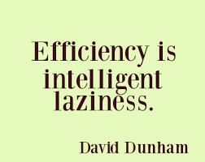

# Setup

<div grid="~ cols-[50%_25%_25%] gap-1">
  <div>
   <v-clicks depth="3">

   - Build tools
     - NPM
       - Node Package Manager.
       - <span v-mark="{type:'underline', color:'orange', at:9, delay:2000}">Vite: Hot reload of UI.</span>
     - SBT
       - <span v-mark="{type:'underline', color:'orange', at:9}">Scala JS</span>
       - Scala JVM
   - Docker
   - Kubernetes
   </v-clicks>
  </div>
  <div>
    
  </div>
  <div>
    
  </div>
</div>

---

# Demo

Dozen of tools to setup ... 

<div grid="~ cols-2">
<div v-click>
package.json, vite.config.js, build.sbt, plugins.sbt, Dockerfile, Kubernetes, ...
</div>

</div>

---

# One line to setup a new project



<div  v-click>Let's automate it with a template</div>

<div  v-click>
```bash
sbt new cheleb/zio-scalajs-laminar.g8 --name=devoxx-fullstack-demo
```
</div>

---

# One line to go to work

<div  v-click>
  

```bash
code devoxx-fullstack-demo
```
</div>


---

## VSCode / Metals 🤘🏼

Task automation with <span v-mark="{type:'circle', color:'orange', at:1}">`.vscode/tasks.json`</span> and `launch.json`

````md magic-move {lines: true, at:2}
```json {*|7|9|11-12}
{
  "version": "2.0.0",
  "tasks": [
    {
       "label": "demo",
        "runOptions": {
            "runOn": "folderOpen"
        },
        "dependsOrder": "sequence",
        "dependsOn": [
            "setup",
            "runDemo"
        ],
        "problemMatcher": [],
        "group": {
            "kind": "build"
        }
    }
  ]
}
```

```json {*|4|8}
{
    "label": "setup",
    "type": "shell",
    "command": "./scripts/setup.sh",
    "presentation": {
        "panel": "dedicated",
        "group": "runDevCmd",
        "close": true
    },
    "group": "build"
}
```

```json {*|3|5-8}
{
    "label": "runDemo",
    "dependsOrder": "parallel",
    "dependsOn": [
        "docker",
        "serverRun",
        "fastLink",
        "npmDev"
    ],
    "problemMatcher": [],
    "group": {
        "kind": "build"
    }
},
```

````

---


# Project Structure / SBT

<div grid="~ cols-3">
  <div></div>
  <div v-click="2">
    
  </div>
  <div></div>
  <div>
    <h4>server</h4>
    
  </div>
  <div v-click="+3">
    </div>
  <div>
    <h4>client</h4>
    
  </div>
</div>

<div v-click="4"  style="position:absolute"  v-motion
  :initial="{ x: 0, y: -100 }"
  :enter="{ x: 160, y: -85 }"
  >
  
</div>


---

# SBT Cross Project
<h4>Shared</h4>

```scala
lazy val shared: CrossProject = crossProject(JSPlatform, JVMPlatform)
// [...]  
lazy val sharedJvm: Project = shared.jvm
lazy val sharedJs: Project  = shared.js
```

<div grid="~ cols-2 gap-4">
<div v-click="+1">
<h4>Server</h4>
```scala {*|3}{at:2}
lazy val server = project
  .settings( /* [...] */ )
  .dependsOn(sharedJvm)
```
</div>
<div v-click="+3">
<h4>Client</h4>
```scala {*|4}{at:4}
lazy val client = project
  .enablePlugins(ScalaJSPlugin)
  .settings( /* [...] */ )
  .dependsOn(sharedJs)
```
</div>
</div>

---

# Setup / Backend


---

### Setup / Frontend / NPM / package.json

```json {*|7-11,20-21|13-18}{lines:true}
{
  "name": "scalaZio-fullstack-demo",
  "private": true,
  "version": "0.0.1",
  "main": "index.js",
  "type": "module",
  "scripts": {
    "dev": "vite",
    "build": "vite build",
    "preview": "vite preview"
  },
  "license": "MIT",
  "dependencies": {
    "@ui5/webcomponents": "2.1.0",
    "@ui5/webcomponents-fiori": "2.1.0",
    "@ui5/webcomponents-icons": "2.1.0",
    "chart.js": "2.9.4"
  },
  "devDependencies": {
    "@scala-js/vite-plugin-scalajs": "^1.0.0",
    "vite": "^5.4.9",
    "typescript": "5.6.3",
    "@types/chart.js": "2.9.29"
  }
}
```


---

### Setup / Frontend / NPM / vite.config.js


```js {*|2|5|8|12}
import { defineConfig } from "vite";
import scalaJSPlugin from "@scala-js/vite-plugin-scalajs";

export default defineConfig({
    plugins: [scalaJSPlugin({
        // path to the directory containing the sbt build
        // default: '.'
        cwd: '../..',

        // sbt project ID from within the sbt build to get fast/fullLinkJS from
        // default: the root project of the sbt build
        projectID: 'client',

        // URI prefix of imports that this plugin catches (without the trailing ':')
        // default: 'scalajs' (so the plugin recognizes URIs starting with 'scalajs:')
        uriPrefix: 'scalajs',
    })],
    build: {
        sourcemap: true,
    }
});
```

<!-- Vite must configure to listen to the ScalaJS transpiler -->

---

# Setup / Frontend


<div v-click v-motion style="position:absolute"  
  :initial="{ x: 0, y: -100 }"
  :enter="{ x: 400, y: -100 }"
  :leave="{ x: 50 }"
>
 Enjoy the ride 🚀

 - Hot reload of UI
 - Warm reload of Backend

</div>
