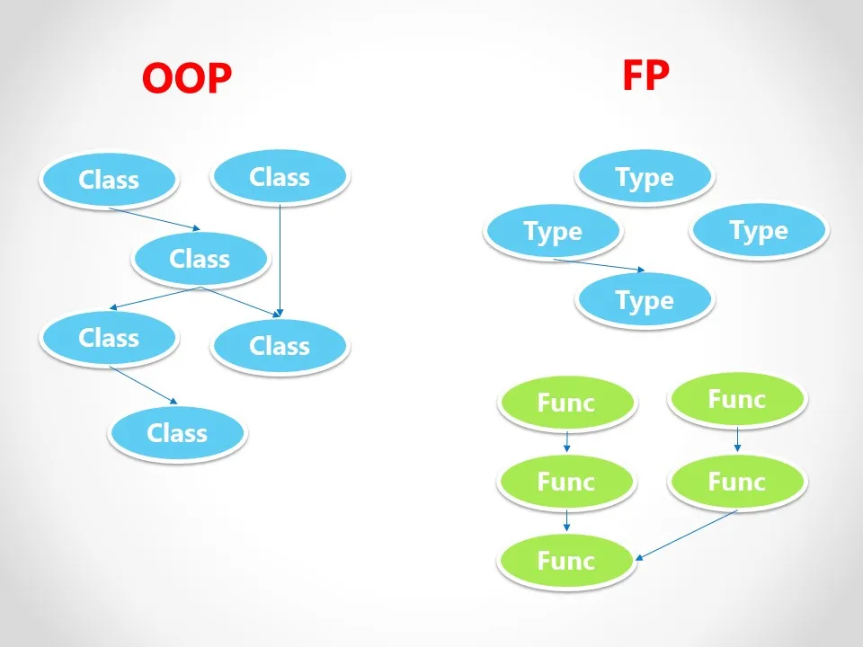

# OOP vs FP

<v-clicks depth="1" style="margin: 2em">

- OOP
  - mutable state
  - inheritance
  - polymorphism
  - statements based
- FP
  - immutable state
  - function composition
  - expression based
</v-clicks>

::right::

<div v-click>

<h2> Scala: OOP && FP</h2>

Why not both ?

</div>

<v-clicks>

- better OOP:
  - variances of type parameters
  - type classes: Ad hoc polymorphism
 
</v-clicks>

---

## OOP vs FP




---
transition: fade
layout: two-cols
---

## Scala Type system

Rich type system...

<v-clicks depth="2">

- Generics
- Variance
- Intersection Types
- Union Types
- Algebraic Data Types
- Opaque Types
- Structural Types
- Dependent Function Types
- Other Types ?

</v-clicks>

::right::

````md magic-move {at:1}

```
. 
```

```scala
//
class Array[A]
```
```scala
trait ZIO[-R, +E, +A]
```
```scala
type A = Database & RabbitMQ
```
```scala
type RegisterReponse = User | Unit
```
```scala
enum Option[+A]:
  case Some[A](value: A)
  case None
```
```scala
opaque type Email = String
```
```
...
```
````

<v-clicks>

- Other Types:
  - Type lambdas
  - Match types
  - Existential types
  - Higher-kinded types
  - Singleton types
  - Refinement types
  - Kind polymorphis
</v-clicks>


<!--

This slide may be interesting to show the complexity of the type system. Intention is not to be arrogant :D

But the more contraint your type system have, the more you can rely on compiler. 

 -->

---
transition: fade
layout: two-cols
---
## Scala types and compiler.

Rich type system brings:

<v-clicks depth="2">

- refined types: 
  - check error early
  - overtyping
- make illegal states unrepresentable
- refactor with confidence

</v-clicks>

<div v-click>

And in the meantime:

</div>

<v-clicks>

- reduce boilerplate
- no boxing / unboxing
- enter the metaprogramming world 👈

</v-clicks>


::right::

````md magic-move {at:1}

```scala
case class User(firstname: String,
                lastname: String,
                email: String,
                password: String,
                age: Int)
```
```scala
case class User(firstname: String,
                lastname: String,
                email: String,
                password: String,
                age: Int :| Positive)
```
```scala
case class User(firstname: String,
                lastname: String,
                email: String,
                password: String,
                age: Int :| Positive)

val user = User("John",
                "Doe",
                "john.doe@gmail.com",
                "notsecured",
                -42) // 💥 compilation error              
```
```scala
case class User(firstname: Firstname,
                lastname: Lastname,
                email: Email,
                password: Password,
                age: Int :| Positive)

opaque type Firstname <: String = String
opaque type Password <: String = String


```
```scala
case class User(firstname: Firstname,
                lastname: Lastname,
                email: Email,
                password: Password,
                age: Int :| Positive)

opaque type Password <: String = String

object Password:
  given JsonCodec[Password] = JsonCodec.string
    .transformOrFail[Password](
      str =>
      if str.length >= 12 then Right(str)
      else Left("Password must be at least 12 characters long"),
      identity
  )
  given Schema[Password] = Schema.string
```
```
This contraints checked will:
 - occur at compile time.
 - be enforce at runtime.

```
```
This contraints can be checked:
 - occur at compile time.
 - be enforce at runtime.

Across the whole code base:
  - from the API to the database.
  - from the database to the API.
```
````


