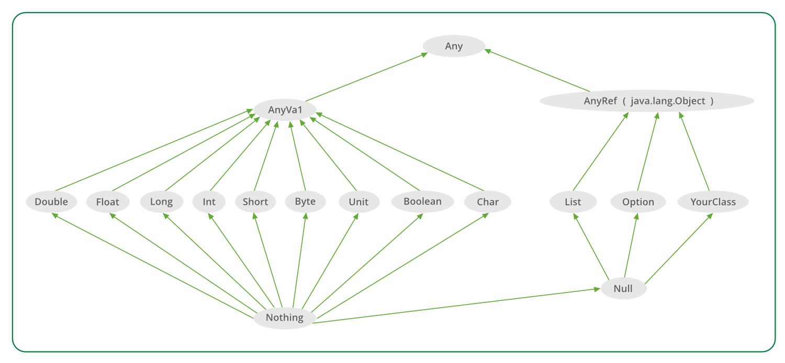

# Typesystem best friend !

<v-clicks depth="2">

- Type:
  - A set of operations
  - A set of values
- ADT:
  - Algebraic Data Type
  - A type that can be constructed from other types
  - A type that can be deconstructed into other types
- Type class:
  - A type that defines a set of operations on a type
  - A type that can be used to extend the functionality of a type
- Generic Derivation

</v-clicks>

---

# Scala type system




---
transition: fade
layout: two-cols
---

# Scala type / ADT

````md magic-move
```scala
enum Color:

  case Black, White
  case Brown(dark: Boolean)

```
```scala
enum Color:

  case Black, White
  case Brown(dark: Boolean)  

sealed trait Totem

case class Dog(color: Color, age: Byte) extends Totem

case class Tree(color: Color, age: Short) extends Totem
```
```scala
enum Color:

  case Black, White
  case Brown(dark: Boolean)

sealed trait Totem

case class Dog(color: Color, age: Byte) extends Totem

case class Tree(color: Color, age: Short) extends Totem
```
```scala
enum Color: // ??? values
  case Black, White
  case Brown(dark: Boolean)

sealed trait Totem

case class Dog(color: Color, age: Byte) extends Totem

case class Tree(color: Color, age: Short) extends Totem
```
```scala
enum Color:                   // 4 values
  case Black, White           // 1 + 1
  case Brown(dark: Boolean)   //   2

sealed trait Totem

case class Dog(color: Color, age: Byte) extends Totem

case class Tree(color: Color, age: Short) extends Totem
```
```scala
enum Color:                   // 4 values
  case Black, White           // 1 + 1
  case Brown(dark: Boolean)   //   2

sealed trait Totem
              // 4                256  
case class Dog(color: Color, age: Byte) extends Totem
              // 4                 65536
case class Tree(color: Color, age: Short) extends Totem
```
```scala
enum Color:                   // 4 values
  case Black, White           // 1 + 1
  case Brown(dark: Boolean)   //   2

sealed trait Totem
              // 4        *       256    = 1024
case class Dog(color: Color, age: Byte) extends Totem
              // 4        *        65536 = 262144
case class Tree(color: Color, age: Short) extends Totem
```
```scala
enum Color:                   // 4 values
  case Black, White           // 1 + 1
  case Brown(dark: Boolean)   //   2

sealed trait Totem // ???
              // 4        *       256    = 1024
case class Dog(color: Color, age: Byte) extends Totem
              // 4        *        65536 = 262144
case class Tree(color: Color, age: Short) extends Totem
```
```scala
enum Color:                   // 4 values
  case Black, White           // 1 + 1
  case Brown(dark: Boolean)   //   2

sealed trait Totem // 1024 + 262144      = 263168
              // 4        *       256    = 1024
case class Dog(color: Color, age: Byte) extends Totem
              // 4        *        65536 = 262144
case class Tree(color: Color, age: Short) extends Totem
```
````


::right::


<v-clicks>

- Le monde se divise en deux catégories,
  - les sum types
  - les product types.
  
- Toi, tu compile.
</v-clicks>

---

# Scala type / generic

<div grid="~ cols-[30%_70%] gap-2">

<div>
<v-clicks depth="3">
  
  - Generic variance
      - invariant
      - covariant
      - contravariant
    - union types
    - intersection types
    - higher-kinded types
  - Function:
    - HOF
    - using
    - given
  - extension

</v-clicks>

</div>

<div style="margin-top: 4em">

````md magic-move {lines: true, at:1}
```scala
trait Animal
trait Dog extends Animal
trait Cat extends Animal 
```
```scala
trait Animal
trait Dog extends Animal
trait Cat extends Animal

class Array[T]

val animals: Array[Animal] = Array[Dog]()
```
```scala
trait Animal
trait Dog extends Animal
trait Cat extends Animal 

class Array[T]

val animals: Array[Animal] = Array[Dog]() 💥
```
```scala
trait Animal
trait Dog extends Animal
trait Cat extends Animal 

trait List[+A] // is co-variant "+"

val animals: List[Animal] = List.empty[Dog]

```

```scala
trait Animal
trait Dog extends Animal
trait Cat extends Animal 

trait Vet[-A] // is contra-variant "-"

val veterinary: Vet[Dog] = Vet[Animal]("Dr. Who") // Contra-variant
```

```scala
type pet = Cat | Dog 
```
```scala
type Environement = Database & RabbitMQ 
```
```scala
trait Functor[F[_]] extends Invariant[F]: 
  def map[A, B](fa: F[A])(f: A => B): F[B]
```
```scala
// Kind of magic
def toJson[A](a: A, encoder: Encoder[A]): String =
  encoder.encode(a)

// ...

val json: String = toJson(user, UserEncoder)

```
```scala
// Kind of magic
def toJson[A](a: A)(encoder: Encoder[A]): String =
  encoder.encode(a)

// ...

val json: String = toJson(user)(UserEncoder)

```
```scala
// Kind of magic
def toJson[A](a: A)(using encoder: Encoder[A]): String =
  encoder.encode(a)

// ...

val json: String = toJson(user)(using UserEncoder)

```
```scala
// Kind of magic
def toJson[A](a: A)(using encoder: Encoder[A]): String =
  encoder.encode(a)

// ...
given Encoder[User] = UserEncoder

val json: String = toJson(user)

```
```scala {10-11}
// Kind of magic
def toJson[A](a: A)(using encoder: Encoder[A]): String =
  encoder.encode(a)

// ...
given Encoder[User] = UserEncoder

val json: String = toJson(user)

extension [A] (a: A)(using encoder: Encoder[A]) 
  def toJson: String = encoder.encode(a)

```
```scala
// Kind of magic
extension [A] (a: A)(using encoder: Encoder[A]) 
  def toJson: String = encoder.encode(a)

// ...
given Encoder[User] = UserEncoder

val json: String = user.toJson


```
```scala
// Kind of magic
import alib.json.*


val json: String = user.toJson


```

````
</div>
</div>


---
transition: fade
layout: two-cols
---

# Type class

````md magic-move
```scala
case class User(firsname: String,
                lastname: String,
                email: String,
                password: String)
```
```scala
case class User(firsname: String,
                lastname: String,
                email: String,
                password: String)

val user: User = fetchFromDB("john.doe@example.com")
Logger.info(user.toString)
```
```scala
case class User(firsname: String,
                lastname: String,
                email: String,
                password: String)

val user: User = fetchFromDB("john.doe@example.com")
Logger.info(user.toString)
// Leaks sensitive data:  User("john", "doe", "john.doe@example.com", "notsecured")
```
```scala
case class User(firsname: String,
                lastname: String,
                email: String,
                password: String):
    def show: String = s"$firstname $lastname <$email>"

val user: User = fetchFromDB("john.doe@example.com")
Logger.info(user.toString) ❌ // Linter error
```
```scala
case class User(firsname: String,
                lastname: String,
                email: String,
                password: String):
    def show: String = s"$firstname $lastname <$email>"

val user: User = fetchFromDB("john.doe@example.com")
Logger.info(user.show)

// User: john doe <john.doe@example.com">
```
```scala {*|7-8|*}
case class User(firsname: String,
                lastname: String,
                email: String,
                password: String)

extension (user: User) 
  def show: String =
     s"${user.firstname} ${user.lastname} <$email>"

val user: User = fetchFromDB("john.doe@example.com")
Logger.info(user.show)

// User: john doe <john.doe@example.com">
```
```scala
case class User(firsname: String,
                lastname: String,
                email: String,
                password: String)

extension (user: User)(using sa: Show[User]) 
  def show: String =
     s"${user.firstname} ${user.lastname} <$email>"
     
val user: User = fetchFromDB("john.doe@example.com")
Logger.info(user.show)

// User: john doe <john.doe@example.com">
```
```scala
case class User(firsname: String,
                lastname: String,
                email: String,
                password: String)

extension (user: User)(using sa: Show[User]) 
  def show: String = sa.show(user)
     
val user: User = fetchFromDB("john.doe@example.com")
Logger.info(user.show) // Not instance of Show[User]

```
```scala
case class User(firsname: String,
                lastname: String,
                email: String,
                password: String)

extension (user: User)(using sa: Show[User]) 
  def show: String = sa.show(user)
     
val user: User = fetchFromDB("john.doe@example.com")
Logger.info(user.show💥) // Not instance of Show[User]
```
```scala
case class User(firsname: String,
                lastname: String,
                email: String,
                password: String)

extension (user: User)(using sa: Show[User]) 
  def show: String = sa.show(user)
     
given Show[User] with
  def show(user: User): String =
    s"${user.firstname} ${user.lastname} <${user.email}>"                


val user: User = fetchFromDB("john.doe@example.com")
Logger.info(user.show)

// User: john doe <john.doe@example.com">
```
```scala
case class User(firsname: String,
                lastname: String,
                email: String,
                password: String)

extension (user: User)(using sa: Show[User]) 
  def show: String =
     sa.show(user)

val user: User = fetchFromDB("john.doe@example.com")
Logger.info(user.show)

// User: john doe <john.doe@example.com">
```
```scala
case class User(firsname: String,
                lastname: String,
                email: String,
                password: String)

extension [A] (a: A)(using sa: Show[A]) 
  def show: String =
     sa.show(a)

val user: User = fetchFromDB("john.doe@example.com")
Logger.info(user.show)

// User: john doe <john.doe@example.com">
```
```scala
case class User(firsname: String,
                lastname: String,
                email: String,
                password: String)


val user: User = fetchFromDB("john.doe@example.com")
Logger.info(user.show)

// User: john doe <john.doe@example.com">
```
````

::right::

<br />
Somewhere else ...
<br />

<div v-click="+7">

````md magic-move {at:8}
```scala {*|*|*|*|*}
package alib.show

trait Show[A]:
  def show(a: A): String
```
```scala {*|*} 
package alib.show

trait Show[A]:
  def show(a: A): String
```
```scala
package alib.show

trait Show[A]:
  def show(a: A): String

extension [A] (a: A)(using sa: Show[A]) 
  def show: String =
     sa.show(a)

```
````

</div>


---
transition: fade
layout: two-cols
---

# Generic Derivation

<br />

````md magic-move {at: 2}
```scala
case class Password(value: String)

// ------

1

"john"

val password = Password("notsecured")
```
```scala
case class Password(value: String)

// ------
import alib.show.*

1.show

"john".show

val password = Password("notsecured")
password.show

```
```scala
case class Password(value: String)

// ------
import alib.show.*

1.show 💥

"john".show 💥


val password = Password("notsecured")
password.show 💥
```
```scala
case class Password(value: String)

// ------
import alib.show.*

given Show[Int] with
  def show(i: Int): String = i.toString

given Show[String] with
  def show(s: String): String = s

given Show[Password] with
  def show(p: Password): String = "********"  

1.show

"john".show


val password = Password("notsecured")
password.show
```
```scala
case class Password(value: String)

// ------
import alib.show.*

1.show

"john".show

val password = Password("notsecured")
password.show
```
```scala
case class Password(value: String)

object Password:
  given Show[Password] with
    def show(p: Password): String = "********"

// ------
import alib.show.*

1.show

"john".show

val password = Password("notsecured")
password.show
```

```scala
import alib.show.*
case class User(firsname: String,
                lastname: String,
                email: String,
                password: Password)

val user: User = fetchFromDB("john.doe@example.com")

user.show
```

````

::right::


<br />

````md magic-move
```scala {*|*}
trait Show[A]:
  def show(a: A): String
```
```scala {*|*|*}
trait Show[A]:
  def show(a: A): String

extension [A] (a: A)(using sa: Show[A]) 
  def show: String =
     sa.show(a)
```
```scala
trait Show[A]:
  def show(a: A): String

extension [A] (a: A)(using sa: Show[A]) 
  def show: String =
     sa.show(a)

object Show:
    given Show[String] with
        def show(a: String): String = a
    
    given Show[Int] with
        def show(a: Int): String = a.toString

    given Show[Password] with
        def show(a: Password): String = "********"    
                        
```
```scala {*|*}
trait Show[A]:
  def show(a: A): String

extension [A] (a: A)(using sa: Show[A]) 
  def show: String =
     sa.show(a)

object Show:
    given Show[String] with
        def show(a: String): String = a
    
    given Show[Int] with
        def show(a: Int): String = a.toString
                        
```
```scala
trait Show[A]:
  def show(a: A): String

extension [A] (a: A)(using sa: Show[A]) 
  def show: String =
     sa.show(a)

object Show extends AutoDerivation[Show]:

    given Show[String] with
        def show(a: String): String = a
    
    given Show[Int] with
        def show(a: Int): String = a.toString
                        
```
```scala
trait Show[A]:
  def show(a: A): String

extension [A] (a: A)(using sa: Show[A]) 
  def show: String =
     sa.show(a)

object Show extends AutoDerivation[Show]:

    // Product type
    override def join[T](ctx: CaseClass[Show, T]): Show[T] =
      ???
    // Sum type
    override def split[T](ctx: SealedTrait[Show, T]): Show[T] = 
      ???

    given Show[String] with
        def show(a: String): String = a
    
    given Show[Int] with
        def show(a: Int): String = a.toString

    given Show[Password] with
        def show(a: Password): String = "********"
                        
```
```scala
trait Show[A]:
  def show(a: A): String

extension [A] (a: A)(using sa: Show[A]) 
  def show: String =
     sa.show(a)

object Show extends AutoDerivation[Show]:

    // Product type
    override def join[T](ctx: CaseClass[Show, T]): Show[T] =
      new Show[T]:
         def show(a: T): String =
           caseClass.parameters
             .map { p => p.typeclass.show(p.deref(a)) }
             .mkString(" ")
    
    // Sum type
    override def split[T](ctx: SealedTrait[Show, T]): Show[T] = 
      new Show[T]:
       def show(a: T): String =
        sealedTrait.choose(a) { sub =>
          sub.typeclass.show(sub.cast(a))
        }
    

    given Show[String] with
        def show(a: String): String = a
    
    given Show[Int] with
        def show(a: Int): String = a.toString

    given Show[Password] with
        def show(a: Password): String = "********"
                        
```
````


---
transition: fade
layout: two-cols
---

# Show\[A\]

````md magic-move
```scala
case class User(firsname: String,
                lastname: String,
                email: Email,
                password: Password)
```
```scala
import alib.show.*

case class User(firsname: String,
                lastname: String,
                email: Email,
                password: Password)

// ---

val user: User = fetchFromDB("john.doe@example")
Logger.info(user.show ❌)                
```
```scala
import alib.show.*

case class User(firsname: String,
                lastname: String,
                email: Email,
                password: Password)

// ---

given Show[User] with
  def show(user: User): String =
    s"${user.firstname} ${user.lastname} <${user.email}>"

val user: User = fetchFromDB("john.doe@example")
Logger.info(user.show)                

```
```scala
import alib.show.*

case class User(firsname: String,
                lastname: String,
                email: Email,
                password: Password)

object User:
  given Show[User] with
    def show(user: User): String =
      s"${user.firstname} ${user.lastname} <${user.email}>"

// ---

val user: User = fetchFromDB("john.doe@example")
Logger.info(user.show)                

```
```scala
import alib.show.*

case class User(firsname: String,
                lastname: String,
                email: Email,
                password: Password)

// ---

given Show[User] = Show.derived[User]

val user: User = fetchFromDB("john.doe@example")
Logger.info(user.show)                

```
```scala
import alib.show.*

case class User(firsname: String,
                lastname: String,
                email: Email,
                password: Password) derives Show

// ---

val user: User = fetchFromDB("john.doe@example")
Logger.info(user.show)                

```
````

::right::

<br />

<v-clicks>

### Opaque type

````md magic-move
```scala

case class Password(value: String)
```
```scala

opaque type Password = String
```
```scala

opaque type Password = String

object Password:
  def apply(value: String): Password = value

  given Show[Password] with
    def show(p: Password): String = "********"
```
````
</v-clicks>


---

# Type class derivation

<v-clicks depth="2">
 
 - type class:
   - a set of operations on a type: Show\[?\]
   - specialized instance for a type: 
     - Show\[Int\]
     - Show\[String\]
     - Show\[Password\]
 - Generic derivation
    - Deconstruct a type into its components
    - Apply the type class to each component
    - Reconstruct the type class instance

</v-clicks>
