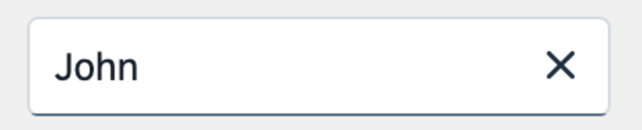
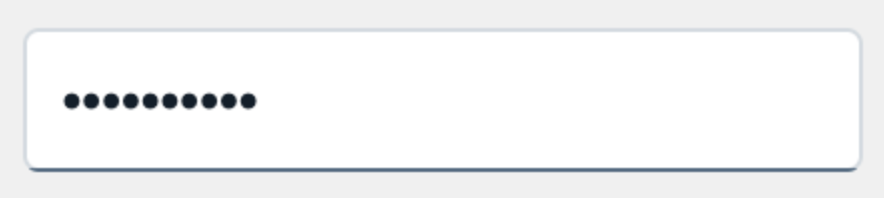

# UI with Laminar


A thin layer on top of Scala.js and the DOM API.

````md magic-move
```scala {*|1|2|3|6|*}
div(
  label("Your name: "),
  input(
    placeholder := "Enter your name here"
  ),
  p(
    "Hello, "
  )
)
```
```scala {*|1}
val nameVar = Var(initial = "world")
div(
  label("Your name: "),
  input(
    placeholder := "Enter your name here"
  ),
  p(
    "Hello, "
  )
)
```
```scala {1,6}
val nameVar: Var[String] = Var(initial = "world")
div(
  label("Your name: "),
  input(
    placeholder := "Enter your name here",
    onInput.mapToValue --> nameVar
  ),
  p(
    "Hello, "
  )
)
```
```scala {1,6,10}
val nameVar: Var[String] = Var(initial = "world")
div(
  label("Your name: "),
  input(
    placeholder := "Enter your name here",
    onInput.mapToValue --> nameVar
  ),
  p(
    "Hello, ",
    text <-- nameVar.signal.map(_.toUpperCase)
  )
)
```
```scala
val nameVar: Var[String] = Var(initial = "world")

def sayHello(nameVar: Var[String]) =
  p("Hello, ",
    text <-- nameVar.signal.map(_.toUpperCase)
  )

div(
  label("Your name: "),
  input(
    placeholder := "Enter your name here",
    onInput.mapToValue --> nameVar
  ),
  sayHello(nameVar)
)
```
````


<!--

Laminar is a thin layer on top of Scala.js and the DOM API.

Laminar offers a reactive programming model that is similar to React.


-->

---

# UI with Laminar: Form

Given a case class, Laminar can derive a form for it.

````md magic-move
```scala
case class Person(
  name: String,
  email: String,
  password: Password,
  passwordConfirmation: Password
)

```
```scala
case class Person( name: String, email: String, password: Password, passwordConfirmation: Password)
```
```scala
case class Person( name: String, email: String, password: Password, passwordConfirmation: Password)

val personVar: Var[Person] = Var(Person("", "", Password(""), Password("")))
```
```scala
case class Person( name: String, email: String, password: Password, passwordConfirmation: Password)

val personVar: Var[Person] = Var(Person("", "", Password(""), Password("")))

div(
 div(
    label("Your name: "),
    input(
      placeholder := "Enter your name here",
      onInput.mapToValue --> (name => personVar.update(_.copy(name = name)))
    )
 ),
```
```scala
case class Person( name: String, email: String, password: Password, passwordConfirmation: Password)

val personVar: Var[Person] = Var(Person("", "", Password(""), Password("")))

div(
 div(
    label("Your name: "),
    input(
      placeholder := "Enter your name here",
      onInput.mapToValue --> (name => personVar.update(_.copy(name = name)))
    )
 ),
  div(
      label("Your email: "),
      input(
        placeholder := "Enter your email here",
        onInput.mapToValue --> (email => personVar.update(_.copy(email = email)))
      )
  ),
//...
```
````

<div v-click v-motion style="position:absolute; padding: 1em; border: 2px solid red; border-radius: 5px" 
  :initial="{ x: 0, y: -100 }"
  :enter="{ x: 400, y: -150 }"
  :leave="{ x: 50 }">
Boilerplate Alert!
</div>

<!--

A real world form would have many fields and the code would be very verbose.

-->

---
src: 05_derivation.md
---

---

# UI with Laminar: Form Derivation

````md magic-move {at:4}
```scala
case class Person( name: String, email: String, password: Password, passwordConfirmation: Password)

val personVar: Var[Person] = Var(Person("", "", Password(""), Password("")))
```
```scala {*|1,7|*}
import dev.cheleb.scalamigen.*

case class Person( name: String, email: String, password: Password, passwordConfirmation: Password)

val personVar: Var[Person] = Var(Person("", "", Password(""), Password("")))

personVar.asForm
```
````

<div v-click=[1,4] v-motion style="position:absolute" duration="1s"
  :initial="{ x: 0, y: -100 }"
  :enter="{ x: 150, y: -30 }"
  :leave="{ x: 200, y: 0 }">

</div>
<div v-click=[2,4] v-motion style="position:absolute" duration="1s"
  :initial="{ x: 0, y: -100 }"
  :enter="{ x: 250, y: -30 }"
  :leave="{ x: 200, y: 0 }">

</div>
<div v-click=[3,4] v-motion style="position:absolute"
  :initial="{ x: 0, y: -100 }"
  :enter="{ x: 500, y: -30 }"
  :leave="{ x: 200, y: 100 }">

</div>
<div v-click=4 v-motion style="position:absolute"
  :initial="{ x: 0, y: -100 }"
  :enter="{ x: 150, y: -30 }"
  :leave="{ x: 50 }">

</div>


<!--
  With Scalamigen, we can derive a form for a case class.
  In short if we can render all the fields of a case class (string, int, date ...), we can derive a form for it.
  Derivation is:
  - based on the typeclass pattern
  - is extensible
  - happens at compile time
-->

---

# Under the hood - Laminar Form Derivation

No boilerplate, no magic, just Scala.

<div v-click="+1"><a href="https://cheleb.github.io/laminar-form-derivation/demo/index.html">Laminar Form Derivation</a> with Magnolia</div>
<ul>
  <li v-click="+2">Case class to form</li>
  <li v-click="+3">Databinding</li>
  <li v-click="+4">Validation</li>
  <li v-click="+5">Error handling</li>
</ul>

<div v-click="+6">

```scala
import import dev.cheleb.scalamigen.*

case class Person(name: String, email: String, password: Password)

val personVar = Var(Person("John", "john.does@foo.bar", Password("notsecured") ))

personVar.asForm

```

</div>
