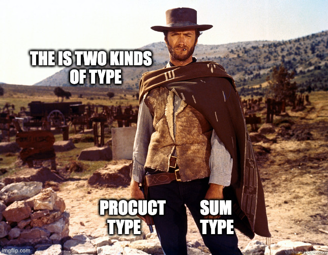
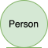

## Metaprogramming


Metaprogramming is the process of writing programs

    ... that write or manipulate other programs.


<br />

<v-clicks depth>

- Runtime:
  - Reflection
- Compile time
  - Macros
  - Type class derivation 👈
</v-clicks>


::right::

<br /><br /><br /><br /><br />

```scala
case class User(firsname: String,
                lastname: String,
                email: String,
                password: String)
```

---
transition: fade
layout: two-cols
---

## Metaprog / ADT

In scala, we can use ADT to represent data types.

<v-clicks>

- ADT = Algebraic Data Type
  - Product type = case class
  - Sum type = sealed trait
</v-clicks>

````md magic-move
```scala
.
```
```scala
// Product type
case class Box(size: Size,
               color: Color)
```
```scala
// Product type ??
case class Box(size: Size,
               color: Color)
// Sum type ??
enum Size:
  case Small
  case Medium
  case Large

enum Color:
  case Red
  case Green
  case Blue(dark: Boolean)
```
```scala
// Product type
case class Box(size: Size,
               color: Color)
// Sum type
enum Size:
  case Small
  case Medium
  case Large

enum Color:
  case Red
  case Green
  case Blue(dark: Boolean)
```

````


::right::




---
transition: fade
layout: two-cols
---


## Metaprog / Generic derivation

Where ?


<div v-click="[1,6]" v-motion style="position:absolute" duration="1s"
  :initial="{ x: 0, y: -100 }"
  :enter="{ x: 210, y: -360 }"
  :click-1="{ x: 310, y: -300 }"
  :click-2="{ x: 310, y: -300 }"
  :click-3="{ x: 310, y: -250 }"
  :click-4="{ x: 310, y: -145 }"
  :leave="{ x: 310 }"
>
  
</div>


::right::

<div v-click="[1,6]" v-motion style="position:absolute" duration="1s"
  :initial="{ x: 0, y: 0 }"
  :enter="{ x: 0, y: 0 }"
  :click-1="{ x: 100, y: 100 }"
  :click-2="{ x: 310, y: -240 }"
  :click-3="{ x: 310, y: -175 }"
  :leave="{ x: 310 }"
>

<br />

<br />

</div>
<div v-click="[1,6]" v-motion style="position:absolute" duration="1s"
  :initial="{ x: 0, y: -200 }"
  :enter="{ x: 100, y: -200 }"
  :click-2="{ x: 200, y: 100 }"
  :click-3="{ x: 310, y: -240 }"
  :leave="{ x: 310 }"
>

</div>

<br /><br /><br /><br /><br />


<div v-click="+3">
````md magic-move {at:3}
```
- Form
```
```
- Form
- HTTP
  - JsonCodec
  - OpenAPI
  - GraphQL
```
```
- Form
- HTTP
  - JsonCodec
  - OpenAPI
  - GraphQL
- SQL
- Avro
- Protobuf
- Config...
```
````
</div>
