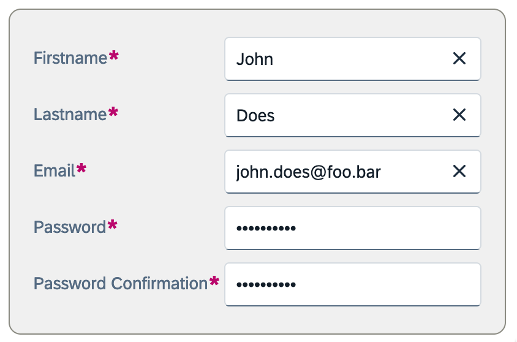

## Metaprogramming


Metaprogramming is the process of writing programs

    ... that write or manipulate other programs.


<br />

<v-clicks depth>

- Runtime:
  - Reflection
- Compile time
  - Macros
  - Type class derivation 👈
</v-clicks>


::right::

<br /><br /><br /><br /><br />

```scala
case class User(firsname: String,
                lastname: String,
                email: String,
                password: String)
```

---
transition: fade
layout: two-cols
---

## Metaprog / ADT

In scala, we can use ADT to represent data types.

* ADT = Algebraic Data Type
  * Product type = case class
  * Sum type = sealed trait

````md magic-move
```scala
// Product type vs Sum type
```
```scala
// Product type
case class Box(size: Int :| Between(0, 100),
               color: Color)
```
```scala
// Product type ??
case class Box(size: Int :| Between(0, 100),
               color: Color)
// Sum type ??
enum Color:
  case Red
  case Green
  case Blue(dark: Boolean)
```
```scala
// Product type
case class Box(size: Int :| Between(0, 100),
               color: Color)
// Sum type
enum Color:
  case Red
  case Green
  case Blue(dark: Boolean)
```

````


::right::


---
transition: fade
layout: two-cols
---

## Metaprog / Type class ?


Somewhere in the codebase 👇


````md magic-move
```
...
```
```scala
trait Show[A]:
  def show(a: A): String

```
```
.
```
```scala

val user: User = fetchFromDB("john.doe@example.com")

```
```scala

val user: User = fetchFromDB("john.doe@example.com")

Logger.info(user.toString)
```
```scala

val user: User = fetchFromDB("john.doe@example.com")

Logger.info(user.toString)
// Leaks sensitive data

```
```scala

val user: User = fetchFromDB("john.doe@example.com")

Logger.info(user.show)

```
```scala
extension (user: User) 
  def show: String = s"${user.firstname} ${user.lastname}"

val user: User = fetchFromDB("john.doe@example.com")

Logger.info(user.show)
```
```scala
extension [A] (a: A)(using sa: Show[A]) 
  def show: String = sa.show(a)

val user: User = fetchFromDB("john.doe@example.com")

Logger.info(user.show)
```
```scala
extension (user: User) 
  def show: String = s"${user.firstname} ${user.lastname}"

val user: User = fetchFromDB("john.doe@example.com")

Logger.info(user.show)
```
```scala
extension (user: User) 
  def show: String = ???

val user: User = fetchFromDB("john.doe@example.com")

Logger.info(user.show)
```
```scala
extension [A] (a: A)
  def show: String = ???

val user: User = fetchFromDB("john.doe@example.com")

Logger.info(user.show)
```
```scala
extension [A] (a: A)(using sa: Show[A]) 
  def show: String = ???

val user: User = fetchFromDB("john.doe@example.com")

Logger.info(user.show)
```
```scala
//                          ?
extension [A] (a: A)(using sa: Show[A]) 
  def show: String = sa.show(a)

val user: User = fetchFromDB("john.doe@example.com")

Logger.info(user.show)
```
```scala
//
extension [A] (a: A)(using sa: Show[A]) 
  def show: String = sa.show(a)

val user: User = fetchFromDB("john.doe@example.com")

Logger.info(user.show)
```
```scala

val user: User = fetchFromDB("john.doe@example.com")

Logger.info(user.show)
```
````

<div style="margin-top: 2em; margin-left: 6em;">
  
</div>
::right::

<br />
<br />
Somewhere else in a deps 👇


<br />


````md magic-move {at:2}
```scala
case class User(firsname: String,
                lastname: String,
                email: String,
                password: String)
```
```scala
// Type class
trait Show[A]:
  def show(a: A): String


case class User(firsname: String,
                lastname: String,
                email: String,
                password: String)
```
````

<div v-click="+14">

````md magic-move {at:16}
```scala
object User:
    given Show[User] with
        def show(user: User): String =
        s"${user.firstname} ${user.lastname}"
```
```
...
```
````
</div>

<div v-click="+15">

```scala
extension [A] (a: A)(using sa: Show[A]) 
  def show: String = sa.show(a)

```

</div>


---

## Metaprog / Generic derivation


````md magic-move

```scala
trait Show[A]:
  def show(a: A): String
```

```scala
trait Show[A]:
  def show(a: A): String

object Show:
  given Show[String] with
    def show(a: String): String = a
  given Show[Int] with
    def show(a: Int): String = a.toString
```
```scala
trait Show[A]:
  def show(a: A): String

object Show:
  given Show[String] with
    def show(a: String): String = a
  given Show[Int] with
    def show(a: Int): String = a.toString
  given Show[Password] with
    def show(a: Password): String = "********"
```
```scala
trait Show[A]:
  def show(a: A): String

object Show extends AutoDerivation[Show]:
  given Show[String] with
    def show(a: String): String = a
  given Show[Int] with
    def show(a: Int): String = a.toString
  given Show[Password] with
    def show(a: Password): String = "********"
```
```scala
trait Show[A]:
  def show(a: A): String

object Show extends AutoDerivation[Show]:

  // Product type
  override def join[T](ctx: CaseClass[Show, T]): Show[T] = ???
  // Sum type
  override def split[T](ctx: SealedTrait[Show, T]): Show[T] = ???

  given Show[String] with
    def show(a: String): String = a
  given Show[Int] with
    def show(a: Int): String = a.toString
  given Show[Password] with
    def show(a: Password): String = "********"
```
```scala
trait Show[A]:
  def show(a: A): String

object Show extends AutoDerivation[Show]:

  def join[T](ctx: CaseClass[Show, T]): Show[T] = value =>
    ctx.params.map { param =>
      param.typeclass.show(param.deref(value))
    }.mkString(s"${ctx.typeInfo.short}(", ",", ")")

  override def split[T](ctx: SealedTrait[Show, T]): Show[T] = value =>
    ctx.choose(value) { sub => sub.typeclass.show(sub.cast(value)) }

  given Show[String] with
    def show(a: String): String = a
  given Show[Int] with
    def show(a: Int): String = a.toString
  given Show[Password] with
    def show(a: Password): String = "********"
```
```scala
trait Show[A]:
  def show(a: A): String

object Show extends AutoDerivation[Show]:

  // Product type
  override def join[T](ctx: CaseClass[Show, T]): Show[T] = ???
  // Sum type
  override def split[T](ctx: SealedTrait[Show, T]): Show[T] = ???

  given Show[String] with
    def show(a: String): String = a
  given Show[Int] with
    def show(a: Int): String = a.toString
  given Show[Password] with
    def show(a: Password): String = "********"

// ...

john.show // User(John, Doe, john.doe@foo.bar, ********)


```

````


---
transition: fade
layout: two-cols
---


## Metaprog / Generic derivation

Where ?


<div v-click="[1,6]" v-motion style="position:absolute" duration="1s"
  :initial="{ x: 0, y: -100 }"
  :enter="{ x: 210, y: -360 }"
  :click-1="{ x: 310, y: -300 }"
  :click-2="{ x: 310, y: -300 }"
  :click-3="{ x: 310, y: -250 }"
  :click-4="{ x: 310, y: -145 }"
  :leave="{ x: 310 }"
>
  
</div>


::right::

<div v-click="[1,6]" v-motion style="position:absolute" duration="1s"
  :initial="{ x: 0, y: 0 }"
  :enter="{ x: 0, y: 0 }"
  :click-1="{ x: 100, y: 100 }"
  :click-2="{ x: 310, y: -240 }"
  :click-3="{ x: 310, y: -175 }"
  :leave="{ x: 310 }"
>

<br />

<br />

</div>
<div v-click="[1,6]" v-motion style="position:absolute" duration="1s"
  :initial="{ x: 0, y: -200 }"
  :enter="{ x: 100, y: -200 }"
  :click-2="{ x: 200, y: 100 }"
  :click-3="{ x: 310, y: -240 }"
  :leave="{ x: 310 }"
>

</div>

<br /><br /><br /><br /><br />


<v-clicks at="2" style="margin-left: 2em">

- Form
- HTTP
  - JsonCodec
  - OpenAPI
  - GraphQL
- SQL
- Avro
- Protobuf
- Config...
</v-clicks>