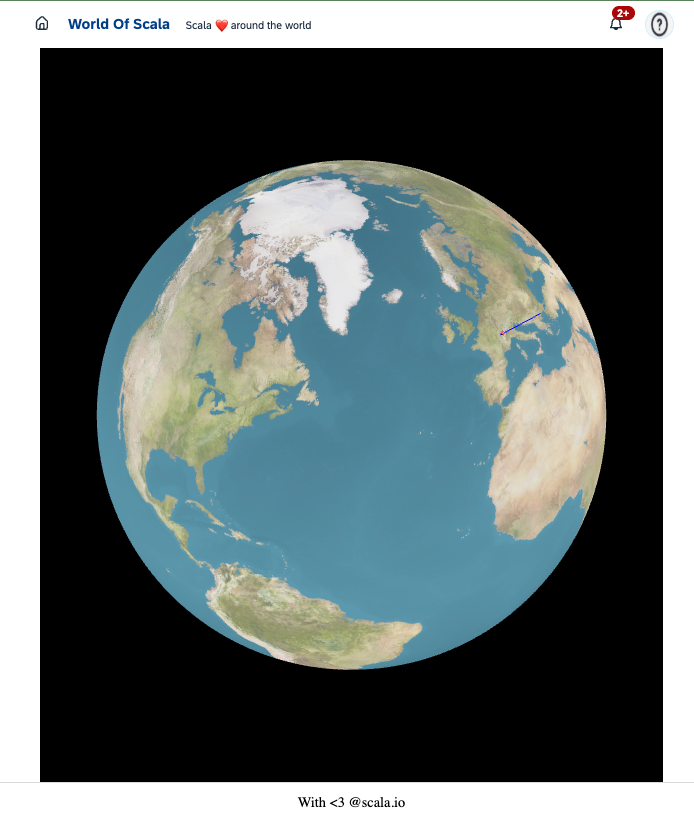

## World of Scala / The App

<v-clicks depth="2">

- Full stack Scala
  - Frontend Scala.js:
    - <a href="https://threejs.org/">ThreeJS</a>
      - [ScalaJS bindings](https://cheleb.github.io/ThreeScalaJS/demo/)
  - Backend: Scala
  - Deployment: Kubernetes
    - Docker
    - Argocd
    - Image updater
</v-clicks>

::right::

---
title: "World of Scala - Deployment"
transition: "fade"
description: "Deployment of the World of Scala application"
---

# World of Scala / The deployment

https://registry.orb.local/v2/world-of-scala/world-of-scala/tags/list

https://argocd-server.argocd.svc.cluster.local/

http://world-of-scala-svc.onouguier-world-of-scala.svc.cluster.local/public/index.html

