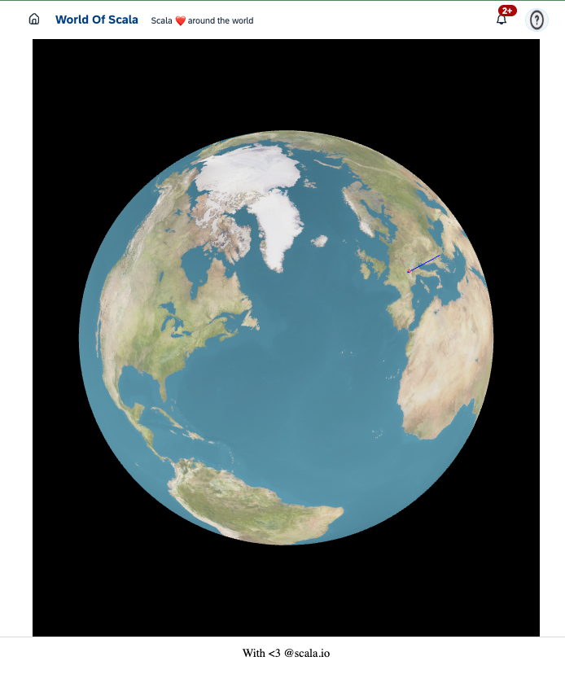

---
# You can also start simply with 'default'
theme: seriph
# random image from a curated Unsplash collection by Anthony
# like them? see https://unsplash.com/collections/94734566/slidev
background: https://cover.sli.dev
# some information about your slides (markdown enabled)
title: Scala Full Stack
info: |
  ## Scala Full Stack

  Learn more at [ZIO <3 ScalaJS <3 Laminar](https://github.com/cheleb/zio-scalajs-laminar.g8)
# apply unocss classes to the current slide
class: text-center
# https://sli.dev/features/drawing
drawings:
  persist: false
# slide transition: https://sli.dev/guide/animations.html#slide-transitions
transition: fade-out
# enable MDC Syntax: https://sli.dev/features/mdc
mdc: true
# take snapshot for each slide in the overview
overviewSnapshots: true
---

<style>
h1, h2 {
  background-color: #2B90B6;
  background-image: linear-gradient(45deg, #4EC5D4 10%, #146b8c 20%);
  background-size: 100%;
  -webkit-background-clip: text;
  -moz-background-clip: text;
  -webkit-text-fill-color: transparent;
  -moz-text-fill-color: transparent;
}
</style>

## Scala Full Stack

With ZIO, Tapir && Laminar

(https://github.com/cheleb/zio-scalajs-laminar.g8)

<div class="abs-br m-6 flex gap-2">
  <button @click="$slidev.nav.openInEditor()" title="Open in Editor" class="text-xl slidev-icon-btn opacity-50 !border-none !hover:text-white">
    <carbon:edit />
  </button>
  <a href="https://github.com/slidevjs/slidev" target="_blank" alt="GitHub" title="Open in GitHub"
    class="text-xl slidev-icon-btn opacity-50 !border-none !hover:text-white">
    <carbon-logo-github />
  </a>
</div>


---
transition: fade
layout: two-cols

---

## 100% Scala

````md magic-move

```md
- Strongly typed

- Functional programming

- Metaprogramming
```
```md
- Strongly typed
  - Type safety (error detection)
  - Development speed

- Functional programming

- Metaprogramming
```
```md
- Strongly typed
  - Type safety (error detection)
  - Development speed

- Functional programming
  - Immutability & pure functions
  - Reactive programming

- Metaprogramming
```
```md
- Strongly typed
  - Type safety (error detection)
  - Development speed

- Functional programming
  - Immutability & pure functions
  - Reactive programming

- Metaprogramming
  - Type class derivation
  - Scala macros
```
````

::right::



---
src: ./pages/00_agenda.md

---

---
src: ./pages/01_scala_complex.md
---

---
src: ./pages/01_vs_java.md

---

---
src: ./pages/02_why.md
---

---
src: ./pages/02_ono-at-ledger.md
---

---
src: ./pages/04_architecture.md
---

---
src: ./pages/03_setup.md
---
---
src: ./pages/05_ui.md
---

---
src: ./pages/06_metaprog.md
---

---

## Agenda / ZIO

- Scala, a complex language  ?
- 10s demo time / 2 lines of shell
- Programming with Type
- Programming with values:  👈
  - Tapir: HTTP client.
  - Effects system: ZIO
- Deployment

<!--

Programming with values:
  - ZIO: Effects system.
  - Tapir: HTTP client.

-->

---
src: ./pages/07_values.md
---

---
src: ./pages/05_zio.md
---

---
src: ./pages/071_tapir_server.md
---

---
src: ./pages/072_tapir_client.md
---

---
src: ./pages/08_all_together.md
---


------

# Scalablytyped

<a href="https://scalablytyped.org">Scalablytyped (scalablytyped.dev)</a> is a tool that generates Scala.js facade for TypeScript definitions.
<div grid="~ cols-5">
<div>

</div>
<div v-click="+2">
Scalablytyped
 
</div>
<div>

</div>
<div v-click="+3">
 
</div>
<div>

</div>
</div>

<div v-click="+4">
Then this facade can be used in ScalaJS code.
</div>

<div grid="~ cols-5">
<div>

</div>
<div v-click="+7">
 
</div>
<div>  

</div>
<div v-click="+8" style="vertical-align:middle;">
 
</div>
<div>

</div>
</div>

<div v-click="+9">
In the template, Scalablytyped is used to <a href="https://github.com/cheleb/zio-laminar-demo/blob/master/modules/client/src/main/scala/com/example/ziolaminardemo/app/demos/ScalablytypedDemoPage.scala#L103">generate facade</a> for Chart.js.

Add result is used in the <a href="http://localhost:5173/public/demos/scalablytyped">Scalablytyped demo</a>.

</div>


---

# Production deployement

In this setup, the frontend is served by the backend, webassets are deployed as webjars.

```bash
MOD=prod sbt -mem 4096 server/run
```

<v-clicks depth="1">

- Standalone Jar
- Docker
- Kubernetes

</v-clicks>

<div v-click>

```bash
sbt new cheleb/zio-scalajs-laminar.g8  --name=zio-laminar-demo-k8s --githubUser=cheleb --with-argocd=true --version=0.0.6 --force

code zio-laminar-demo-k8s
```

</div>

---
src: ./pages/11_deployment.md
---

---
transition: fade
layout: two-cols

---

# Conclusion


* Definitively
* Isomorphic
* DX
* Type safety
  * Boilerplate free
* Reactive to the core

::right::

## Scala full stack

<br />

* ScalaJS really complete.
  * JS Interop
* Compiler is your friend.
* Effects system
  * Significant learning curve
  * Reactive programming is not easy

---

# Take over / What next?

<div grid="~ cols-2 gap-4">
  <div>
    <h3>In the box</h3>

Oneliners

 <v-clicks depth="3">

   - scafolding
   - Form derivation
   - Scalablytyped
   - Http client
   - Docker deployement
   - K8s deployement
     - CD ArgoCD
     - Image updater
  

 </v-clicks>
  </div>
  <div>
    <h3>Next</h3>
    <v-clicks depth="3">

   - Testing: Testcontainers, ZIO Test
   - Observability: ZIO Telemetry, ZIO Tracing
   - GraphQL: Caliban
   - WebSockets
   - Security: OTP, OAuth, JWT
   - WASM
   - µServices: ZIO gRPC, ZIO-Pravega
   - Resiliency(?): ZIO Circuit Breaker, ZIO Rate Limiter 
   - Service Mesh: Istio
   - CI: GitHub Actions

 </v-clicks>

  </div>
</div>


---

## Resources

### Languages && Librairies

<div grid="~ cols-2">
 <v-clicks>

  - [ScalaJS](https://www.scala-js.org)  by ScalaCenter / Sebastien Doeraene
  - [SBT](https://www.scala-sbt.org)
  - [Scalablytyped](https://scalablytyped.org)
</v-clicks>
<v-clicks>

  - [ZIO](https://zio.dev) by Ziverge
  - [Laminar](https://laminar.dev) by raquo
  - [Tapir](https://tapir.softwaremill.com) by SoftwareMill
</v-clicks>
</div>


#### Tools && Mentors


<div grid="~ cols-2">
 <v-clicks>


* [Vite](https://vitejs.dev) 
* [Docker](https://www.docker.com)
* [VSCode](https://code.visualstudio.com)
* [Metals](https://scalameta.org/metals/)
</v-clicks>
<v-clicks>

* [RTJVM](https://rockthejvm.com) by Daniel Ciociarlan
* [Incredible Kit Langton](https://www.youtube.com/watch?v=JHriftPO62I)
</v-clicks>
</div>


---

# Thank you

# Questions?
