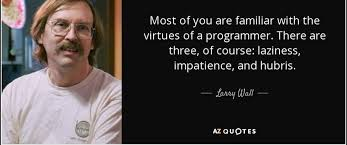
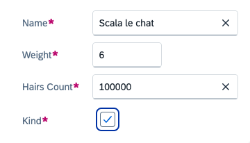
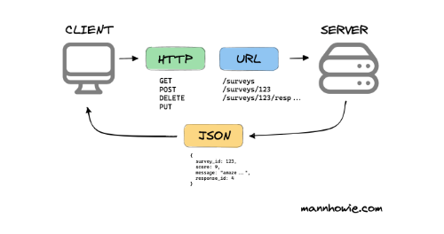
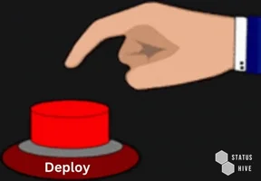
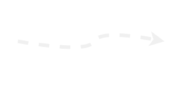
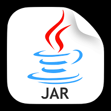

---
# You can also start simply with 'default'
theme: seriph
# random image from a curated Unsplash collection by Anthony
# like them? see https://unsplash.com/collections/94734566/slidev
background: https://cover.sli.dev
# some information about your slides (markdown enabled)
title: Scala Full Stack
info: |
  ## Scala Full Stack

  Learn more at [ZIO <3 ScalaJS <3 Laminar](https://github.com/cheleb/zio-scalajs-laminar.g8)
# apply unocss classes to the current slide
class: text-center
# https://sli.dev/features/drawing
drawings:
  persist: false
# slide transition: https://sli.dev/guide/animations.html#slide-transitions
transition: fade-out
# enable MDC Syntax: https://sli.dev/features/mdc
mdc: true
# take snapshot for each slide in the overview
overviewSnapshots: true
---

# Scala Full Stack

With ZIO, Tapir && Laminar


(https://github.com/cheleb/zio-scalajs-laminar.g8)


<div class="abs-br m-6 flex gap-2">
  <button @click="$slidev.nav.openInEditor()" title="Open in Editor" class="text-xl slidev-icon-btn opacity-50 !border-none !hover:text-white">
    <carbon:edit />
  </button>
  <a href="https://github.com/slidevjs/slidev" target="_blank" alt="GitHub" title="Open in GitHub"
    class="text-xl slidev-icon-btn opacity-50 !border-none !hover:text-white">
    <carbon-logo-github />
  </a>
</div>

<!--
The last comment block of each slide will be treated as slide notes. It will be visible and editable in Presenter Mode along with the slide. [Read more in the docs](https://sli.dev/guide/syntax.html#notes)
-->

---
transition: fade-out
---

# Agenda

<v-clicks depth="2">

  - Why this talk ?
  - Architecture && Librairies
  - Demo time.
  - ZIO
  - Deep dive:
    - End User Experience.
    - Library internals.
    - Scala derivation metaprogramming.
  - Deployment.
</v-clicks>

---
src: ./pages/01_why.md
---

---
src: ./pages/02_ono-at-ledger.md
---

---

# Monolith 3-tiers architecture


---
src: ./pages/03_action.md
---

---
src: ./pages/04_setup.md
---

---
src: ./pages/04_architecture.md
---

---

# Agenda


  - Why this talk ?
  - Architecture && Librairies
  - Demo time.
  - ZIO 👈
  - Deep dive: 
    - End User Experience.
    - Library internals.
    - Scala derivation metaprogramming.
  - Deployment.

---
src: ./pages/03_zio.md
---

---

# Scala Full Stack (lazy guide to)


<v-clicks depth="3">

* One line to setup a new project ✅
* One line to start the dev environment ✅
* One line to bind data in the UI
* One line to expose API
* One line to consume API
* One line to deploy


</v-clicks>


<div v-click="[1, 2]"  v-motion
  :enter="{ x: 250, y:-150 }"
  :leave="{ x: 50 }"
>
  
</div>
<div v-click="[2, 3]"  v-motion
  :initial="{ x: -50, y:-370 }"
  :enter="{ x: 350, y:-150 }"
  :leave="{ x: 50 }"
>
  
</div>
<div v-click="[3, 4]"  v-motion
  :initial="{ x: -50, y:-500 }"
  :enter="{ x: 350, y:-150 }"
  :leave="{ x: 50 }"
>
  
</div>
<div v-click="[4, 6]"  v-motion
  :initial="{ x: -50, y:0 }"
  :enter="{ x: 350, y:-150 }"
  :leave="{ x: 50 }"
>
  
</div>
<div v-click="6"  v-motion
  :initial="{ x: -50, y:-0 }"
  :enter="{ x: 300, y:-150 }"
  :leave="{ x: 50 }"
>
  
</div>


---
src: ./pages/05_ui.md
---

---
src: ./pages/06_tapir.md
---

---

````md magic-move {lines: true}


```scala
object ScalaFullStack:
  
  object Frontend

  object Backend  
```

```scala {3-6}
object ScalaFullStack:
  
  object Frontend:
    val laminar = "Type-safe, reactive UI library"
    val zio = "Type-safe, composable asynchronous and  concurrent programming"
    val tapir = "Type-safe HTTP client generator"

  object Backend:
```

```scala {8-11}
object ScalaFullStack:
  
  object Frontend:
    val laminar = "Type-safe, reactive UI library"
    val zio = "Type-safe, composable asynchronous and  concurrent programming"
    val tapir = "Type-safe HTTP client"

  object Backend:
    val tapir = "Type-safe HTTP Controller"
    val zio = "Type-safe, composable asynchronous and concurrent programming"
    val quill = "Compile-time query generation"  
```

```scala {*|5,9,14|6,10,13}
object ScalaFullStack:
  
  object Frontend:
    val laminar = "Type-safe, reactive UI library"
    val zio = "Type-safe, composable asynchronous and  concurrent programming"
    val tapir = "Type-safe HTTP client"

  object Shared:
    val zio = "ZIO-Json"
    val tapir = "Type-safe HTTP endpoint definitions"

  object Server:
    val tapir = "Type-safe HTTP Controller"
    val zio = "Type-safe, composable asynchronous and  concurrent programming"
    val quill = "Compile-time query generation"

```
````

---
src: ./pages/03_zio.md
---

---


---

# Shared

What can be shared between the client and the server?

<ul>
 <li v-click>Payloads</li>
 <li v-click>Business logic</li>
 <li v-click>Validation</li>
 <li v-click>Error handling</li>
</ul>

<div v-click class="left-30%"> And ... </div>
<ul><li v-click><span v-mark="{type:'circle', color:'orange', at:8}">REST API definition</span></li></ul>
<div v-click class="right-31%">(kinda code centrict-contract first)</div>


---
src: ./pages/05_tapir.md
---

---
src: ./pages/06_laminar.md
---
---

# Under the hood - Laminar Form Derivation

No boilerplate, no magic, just Scala.

<div v-click="+1"><a href="https://cheleb.github.io/laminar-form-derivation/demo/index.html">Laminar Form Derivation</a> with Magnolia</div>
<ul>
  <li v-click="+2">Case class to form</li>
  <li v-click="+3">Databinding</li>
  <li v-click="+4">Validation</li>
  <li v-click="+5">Error handling</li>
</ul>

<div v-click="+6">

```scala
import import dev.cheleb.scalamigen.*

case class Person(name: String, email: String, password: Password)

val personVar = Var(Person("John", "john.does@foo.bar", Password("notsecured") ))

personVar.asForm

```

</div>

------

# Scalablytyped

<a href="https://scalablytyped.org">Scalablytyped (scalablytyped.dev)</a> is a tool that generates Scala.js facade for TypeScript definitions.
<div grid="~ cols-5">
<div>

</div>
<div v-click="+2">
Scalablytyped
 
</div>
<div>

</div>
<div v-click="+3">
 
</div>
<div>

</div>
</div>

<div v-click="+4">
Then this facade can be used in ScalaJS code.
</div>

<div grid="~ cols-5">
<div>

</div>
<div v-click="+7">
 
</div>
<div>  

</div>
<div v-click="+8" style="vertical-align:middle;">
 
</div>
<div>

</div>
</div>

<div v-click="+9">
In the template, Scalablytyped is used to <a href="https://github.com/cheleb/zio-laminar-demo/blob/master/modules/client/src/main/scala/com/example/ziolaminardemo/app/demos/ScalablytypedDemoPage.scala#L103">generate facade</a> for Chart.js.

Add result is used in the <a href="http://localhost:5173/public/demos/scalablytyped">Scalablytyped demo</a>.

</div>


---

# Production deployement

In this setup, the frontend is served by the backend, webassets are deployed as webjars.

```bash
MOD=prod sbt -mem 4096 server/run
```

<v-clicks depth="1">

- Standalone Jar
- Docker
- Kubernetes

</v-clicks>

<div v-click>

```bash
sbt new cheleb/zio-scalajs-laminar.g8  --name=zio-laminar-demo-k8s --githubUser=cheleb --with-argocd=true --version=0.0.6 --force

code zio-laminar-demo-k8s
```

</div>


---

# Take over / What next?

<div grid="~ cols-2 gap-4">
  <div>
    <h3>In the box</h3>

Oneliners

 <v-clicks depth="3">

   - scafolding
   - Form derivation
   - Scalablytyped
   - Http client
   - Docker deployement
   - K8s deployement
     - CD ArgoCD
     - Image updater
  

 </v-clicks>
  </div>
  <div>
    <h3>Next</h3>
    <v-clicks depth="3">

   - Testing: Testcontainers, ZIO Test
   - Observability: ZIO Telemetry, ZIO Tracing
   - GraphQL: Caliban
   - WebSockets
   - Security: OTP, OAuth, JWT
   - WASM
   - µServices: ZIO gRPC, ZIO-Pravega
   - Resiliency(?): ZIO Circuit Breaker, ZIO Rate Limiter 
   - Service Mesh: Istio
   - CI: GitHub Actions

 </v-clicks>

  </div>
</div>


---

## Resources

### Languages && Librairies

<div grid="~ cols-2">
 <v-clicks>

  - [ScalaJS](https://www.scala-js.org)  by ScalaCenter / Sebastien Doeraene
  - [SBT](https://www.scala-sbt.org)
  - [Scalablytyped](https://scalablytyped.org)
</v-clicks>
<v-clicks>

  - [ZIO](https://zio.dev) by Ziverge
  - [Laminar](https://laminar.dev) by raquo
  - [Tapir](https://tapir.softwaremill.com) by SoftwareMill
</v-clicks>
</div>


#### Tools && Mentors


<div grid="~ cols-2">
 <v-clicks>


* [Vite](https://vitejs.dev) 
* [Docker](https://www.docker.com)
* [VSCode](https://code.visualstudio.com)
* [Metals](https://scalameta.org/metals/)
</v-clicks>
<v-clicks>

* [RTJVM](https://rockthejvm.com) by Daniel Ciociarlan
* [Incredible Kit Langton](https://www.youtube.com/watch?v=JHriftPO62I)
</v-clicks>
</div>


---

# Thank you

# Questions?
