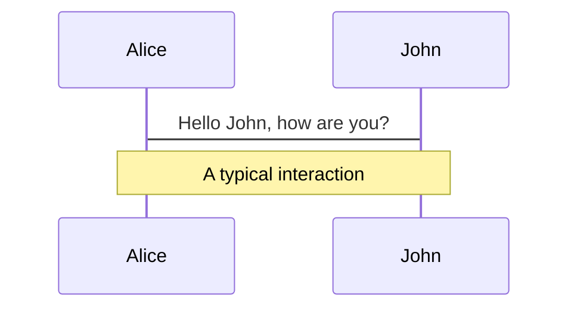
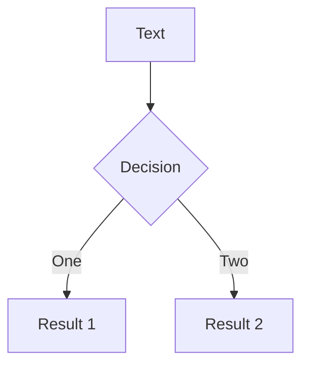
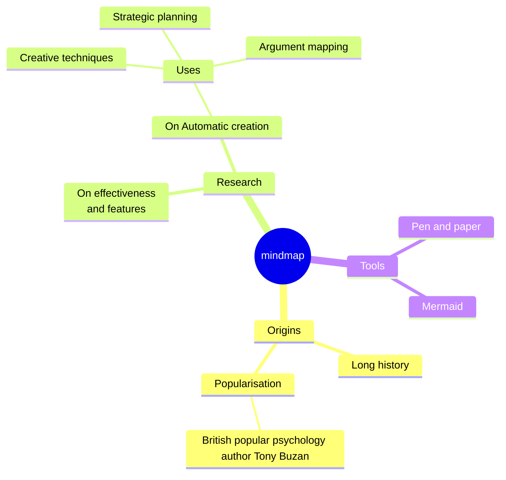
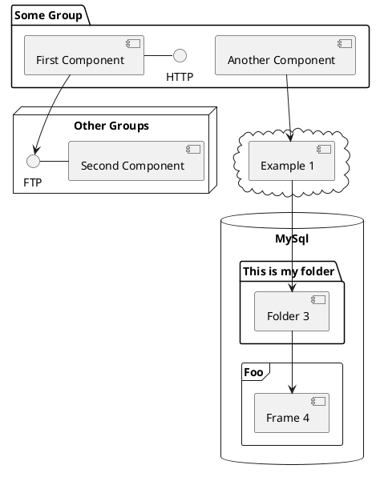

---
# You can also start simply with 'default'
theme: seriph
# random image from a curated Unsplash collection by Anthony
# like them? see https://unsplash.com/collections/94734566/slidev
background: https://cover.sli.dev
# some information about your slides (markdown enabled)
title: Scala Full Stack
info: |
  ## Scala Full Stack

  Learn more at [ZIO <3 ScalaJS <3 Laminar](https://github.com/cheleb/zio-scalajs-laminar.g8)
# apply unocss classes to the current slide
class: text-center
# https://sli.dev/features/drawing
drawings:
  persist: false
# slide transition: https://sli.dev/guide/animations.html#slide-transitions
transition: slide-left
# enable MDC Syntax: https://sli.dev/features/mdc
mdc: true
# take snapshot for each slide in the overview
overviewSnapshots: true
---

# Scala Full Stack

Presentation slides for developers

<div class="pt-12">
  <span @click="$slidev.nav.next" class="px-2 py-1 rounded cursor-pointer" hover="bg-white bg-opacity-10">
    Press Space for next page <carbon:arrow-right class="inline"/>
  </span>
</div>

<div class="abs-br m-6 flex gap-2">
  <button @click="$slidev.nav.openInEditor()" title="Open in Editor" class="text-xl slidev-icon-btn opacity-50 !border-none !hover:text-white">
    <carbon:edit />
  </button>
  <a href="https://github.com/slidevjs/slidev" target="_blank" alt="GitHub" title="Open in GitHub"
    class="text-xl slidev-icon-btn opacity-50 !border-none !hover:text-white">
    <carbon-logo-github />
  </a>
</div>

<!--
The last comment block of each slide will be treated as slide notes. It will be visible and editable in Presenter Mode along with the slide. [Read more in the docs](https://sli.dev/guide/syntax.html#notes)
-->

---
transition: fade-out
---


# Table of contents

<Toc minDepth="1" maxDepth="1"></Toc>


---

# Agenda


````md magic-move

```scala {*|1|3-9|11-15}

object ScalaFullStack:
  
  object SetUp:

    val scalfold = "sbt new cheleb/zio-scalajs-laminar.g8"

    val build = "sbt"

    val ide = "VSCode / Metals 🤘🏼"

  object Projects:

     object Frontend

     object Backend 


```

````

---

# Setup


```bash
sbt new cheleb/zio-scalajs-laminar.g8 --name=scalaio-full-stack

code scalaio-full-stack
```

* VSCode / Metals 🤘🏼
* sbt
* npm / vite
* Docker

---

## VSCode / Metals 🤘🏼

Task automation with `.vscode/tasks.json` and `launch.json`

````md magic-move {lines: true}
```json {7|9|11-12}
{
  "version": "2.0.0",
  "tasks": [
    {
       "label": "demo",
        "runOptions": {
            "runOn": "folderOpen"
        },
        "dependsOrder": "sequence",
        "dependsOn": [
            "setup",
            "runDemo"
        ],
        "problemMatcher": [],
        "group": {
            "kind": "build"
        }
    }
  ]
}
```

```json
{
    "label": "setup",
    "type": "shell",
    "command": "./scripts/setup.sh",
    "presentation": {
        "panel": "dedicated",
        "group": "runDevCmd",
        "close": true
    },
    "group": "build"
}
```

```json
{
    "label": "runDemo",
    "dependsOrder": "parallel",
    "dependsOn": [
        "docker",
        "serverRun",
        "fastLink",
        "npmDev"
    ],
    "problemMatcher": [],
    "group": {
        "kind": "build"
    }
},
```

````

---

## sbt

```scala {*|1-2|3-5|6-8|9-10|11-12|13-14}
// Cross project support, to spread project resources between js and jvm world
addSbtPlugin("org.portable-scala" % "sbt-scalajs-crossproject" % "1.3.2")
// Scala.js support
addSbtPlugin("org.scala-js" % "sbt-scalajs"        % "1.17.0")
addSbtPlugin("org.scala-js" % "sbt-jsdependencies" % "1.0.2")
// Scala.js bundler
addSbtPlugin("ch.epfl.scala" % "sbt-scalajs-bundler"     % "0.21.1")
addSbtPlugin("ch.epfl.scala" % "sbt-web-scalajs-bundler" % "0.21.1")
// TypeScript support
addSbtPlugin("org.scalablytyped.converter" % "sbt-converter" % "1.0.0-beta44")
// Static file generator
addSbtPlugin("org.playframework.twirl" % "sbt-twirl" % "2.0.5")
// Will reStart server on code modification.
addSbtPlugin("io.spray" % "sbt-revolver" % "0.10.0")
```


---

## npm / vite

```js {5|8|12}
import { defineConfig } from "vite";
import scalaJSPlugin from "@scala-js/vite-plugin-scalajs";

export default defineConfig({
    plugins: [scalaJSPlugin({
        // path to the directory containing the sbt build
        // default: '.'
        cwd: '../..',

        // sbt project ID from within the sbt build to get fast/fullLinkJS from
        // default: the root project of the sbt build
        projectID: 'client',

        // URI prefix of imports that this plugin catches (without the trailing ':')
        // default: 'scalajs' (so the plugin recognizes URIs starting with 'scalajs:')
        uriPrefix: 'scalajs',
    })],
    build: {
        sourcemap: true,
    }
});
```

---

````md magic-move {lines: true}


```scala
object ScalaFullStack:
  
  object Frontend

  object Backend  
```

```scala {*|3-6|8-11|5-6,9-10}
object ScalaFullStack:
  
  object Frontend:
    val laminar = "Type-safe, reactive UI library"
    val zio = "Type-safe, composable asynchronous and  concurrent programming"
    val tapir = "Type-safe HTTP client generator"

  object Backend:
    val tapir = "Type-safe HTTP client generator"
    val zio = "Type-safe, composable asynchronous and concurrent programming"
    val quill = "Compile-time query generation"
  

  
```

```scala
object ScalaFullStack:
  
  object Frontend:
    val laminar = "Type-safe, reactive UI library"
  
  object Shared:
    val zio = "Type-safe, composable asynchronous and  concurrent programming"
    val tapir = "Type-safe HTTP client generator"

  object Server:
    val quill = "Compile-time query generation"

```
````

---

# Components

<div grid="~ cols-2 gap-4">
<div>

You can use Vue components directly inside your slides.

We have provided a few built-in components like `<Tweet/>` and `<Youtube/>` that you can use directly. And adding your custom components is also super easy.

```html
<Counter :count="10" />
```

<!-- ./components/Counter.vue -->
<Counter :count="10" m="t-4" />

Check out [the guides](https://sli.dev/builtin/components.html) for more.

</div>
<div>

```html
<Tweet id="1390115482657726468" />
```

<Tweet id="1390115482657726468" scale="0.65" />

</div>
</div>

<!--
Presenter note with **bold**, *italic*, and ~~striked~~ text.

Also, HTML elements are valid:
<div class="flex w-full">
  <span style="flex-grow: 1;">Left content</span>
  <span>Right content</span>
</div>
-->

---
class: px-20
---

# Themes

Slidev comes with powerful theming support. Themes can provide styles, layouts, components, or even configurations for tools. Switching between themes by just **one edit** in your frontmatter:

<div grid="~ cols-2 gap-2" m="t-2">

```yaml
---
theme: default
---
```

```yaml
---
theme: seriph
---
```


</div>

Read more about [How to use a theme](https://sli.dev/guide/theme-addon#use-theme) and
check out the [Awesome Themes Gallery](https://sli.dev/resources/theme-gallery).

---

# Clicks Animations

You can add `v-click` to elements to add a click animation.

<div v-click>

This shows up when you click the slide:

```html
<div v-click>This shows up when you click the slide.</div>
```

</div>

<br>

<v-click>

The <span v-mark.red="3"><code>v-mark</code> directive</span>
also allows you to add
<span v-mark.circle.orange="4">inline marks</span>
, powered by [Rough Notation](https://roughnotation.com/):

```html
<span v-mark.underline.orange>inline markers</span>
```

</v-click>

<div mt-20 v-click>

[Learn more](https://sli.dev/guide/animations#click-animation)

</div>

---

# Motions

Motion animations are powered by [@vueuse/motion](https://motion.vueuse.org/), triggered by `v-motion` directive.

```html
<div
  v-motion
  :initial="{ x: -80 }"
  :enter="{ x: 0 }"
  :click-3="{ x: 80 }"
  :leave="{ x: 1000 }"
>
  Slidev
</div>
```

<div class="w-60 relative">
  <div class="relative w-40 h-40">
    
    
    
  </div>

  <div
    class="text-5xl absolute top-14 left-40 text-[#2B90B6] -z-1"
    v-motion
    :initial="{ x: -80, opacity: 0}"
    :enter="{ x: 0, opacity: 1, transition: { delay: 2000, duration: 1000 } }">
    Slidev
  </div>
</div>

<!-- vue script setup scripts can be directly used in markdown, and will only affects current page -->
<script setup lang="ts">
const final = {
  x: 0,
  y: 0,
  rotate: 0,
  scale: 1,
  transition: {
    type: 'spring',
    damping: 10,
    stiffness: 20,
    mass: 2
  }
}
</script>

<div
  v-motion
  :initial="{ x:35, y: 30, opacity: 0}"
  :enter="{ y: 0, opacity: 1, transition: { delay: 3500 } }">

[Learn more](https://sli.dev/guide/animations.html#motion)

</div>

---

# LaTeX

LaTeX is supported out-of-box. Powered by [KaTeX](https://katex.org/).

<div h-3 />

Inline $\sqrt{3x-1}+(1+x)^2$

Block
$$ {1|3|all}
\begin{aligned}
\nabla \cdot \vec{E} &= \frac{\rho}{\varepsilon_0} \\
\nabla \cdot \vec{B} &= 0 \\
\nabla \times \vec{E} &= -\frac{\partial\vec{B}}{\partial t} \\
\nabla \times \vec{B} &= \mu_0\vec{J} + \mu_0\varepsilon_0\frac{\partial\vec{E}}{\partial t}
\end{aligned}
$$

[Learn more](https://sli.dev/features/latex)

---

# Diagrams

You can create diagrams / graphs from textual descriptions, directly in your Markdown.

<div class="grid grid-cols-4 gap-5 pt-4 -mb-6">









</div>

Learn more: [Mermaid Diagrams](https://sli.dev/features/mermaid) and [PlantUML Diagrams](https://sli.dev/features/plantuml)

---
foo: bar
dragPos:
  square: -26,0,0,0
---

# Draggable Elements

Double-click on the draggable elements to edit their positions.

<br>

###### Directive Usage

```md

```

<br>

###### Component Usage

```md
<v-drag text-3xl>
  <carbon:arrow-up />
  Use the `v-drag` component to have a draggable container!
</v-drag>
```

<v-drag pos="663,206,261,_,-15">
  <div text-center text-3xl border border-main rounded>
    Double-click me!
  </div>
</v-drag>


###### Draggable Arrow

```md
<v-drag-arrow two-way />
```

<v-drag-arrow pos="67,452,253,46" two-way op70 />

---
src: ./pages/imported-slides.md
hide: false
---

---

# Monaco Editor

Slidev provides built-in Monaco Editor support.

Add `{monaco}` to the code block to turn it into an editor:

```ts {monaco}
import { ref } from 'vue'
import { emptyArray } from './external'

const arr = ref(emptyArray(10))
```

Use `{monaco-run}` to create an editor that can execute the code directly in the slide:

```ts {monaco-run}
import { version } from 'vue'
import { emptyArray, sayHello } from './external'

sayHello()
console.log(`vue ${version}`)
console.log(emptyArray<number>(10).reduce(fib => [...fib, fib.at(-1)! + fib.at(-2)!], [1, 1]))
```

---
layout: center
class: text-center
---

# Learn More

[Documentation](https://sli.dev) · [GitHub](https://github.com/slidevjs/slidev) · [Showcases](https://sli.dev/resources/showcases)

<PoweredBySlidev mt-10 />
