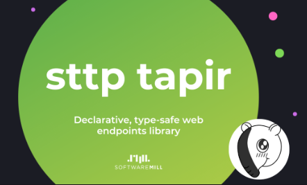

---
# You can also start simply with 'default'
theme: seriph
# random image from a curated Unsplash collection by Anthony
# like them? see https://unsplash.com/collections/94734566/slidev
background: https://cover.sli.dev
# some information about your slides (markdown enabled)
title: Scala Full Stack
info: |
  ## Scala Full Stack

  Learn more at [ZIO <3 ScalaJS <3 Laminar](https://github.com/cheleb/zio-scalajs-laminar.g8)
# apply unocss classes to the current slide
class: text-center
# https://sli.dev/features/drawing
drawings:
  persist: false
# slide transition: https://sli.dev/guide/animations.html#slide-transitions
transition: slide-left
# enable MDC Syntax: https://sli.dev/features/mdc
mdc: true
# take snapshot for each slide in the overview
overviewSnapshots: true
---

# Scala Full Stack

With ZIO, Tapir && Laminar


<div class="abs-br m-6 flex gap-2">
  <button @click="$slidev.nav.openInEditor()" title="Open in Editor" class="text-xl slidev-icon-btn opacity-50 !border-none !hover:text-white">
    <carbon:edit />
  </button>
  <a href="https://github.com/slidevjs/slidev" target="_blank" alt="GitHub" title="Open in GitHub"
    class="text-xl slidev-icon-btn opacity-50 !border-none !hover:text-white">
    <carbon-logo-github />
  </a>
</div>

<!--
The last comment block of each slide will be treated as slide notes. It will be visible and editable in Presenter Mode along with the slide. [Read more in the docs](https://sli.dev/guide/syntax.html#notes)
-->

---
transition: fade-out
---

# Scala Full Stack

<ul>
  <li v-click="+1">Scala JS</li>
  <li v-click="+2">Scala JVM</li>
  <li v-click="+3">Scala Native</li>
  <li v-click="+4">Scala Wasm</li>
</ul>

---
src: ./pages/01_ono-at-ledger.md
---

---
src: ./pages/02_why.md
---

---


# Agenda

<div grid="~ cols-[50%_50%] gap-1">
  <div>

````md magic-move
```scala

object ScalaFullStack:
  
  object SetUp

  object Projects:

     object Frontend

     object Backend 

```

```scala

object ScalaFullStack:
  
  object SetUp:

    val build = ("sbt", "npm/Vite", "Docker")

    val ide = "VSCode / Metals 🤘🏼"

    val scalfold = "sbt new cheleb/zio-scalajs-laminar.g8"

  object Projects:

     object Frontend

     object Backend 

```

````
</div>
  <div>
    
  </div>
</div>

---
src: ./pages/03_setup.md
---

---


````md magic-move {lines: true}


```scala
object ScalaFullStack:
  
  object Frontend

  object Backend  
```

```scala {3-6}
object ScalaFullStack:
  
  object Frontend:
    val laminar = "Type-safe, reactive UI library"
    val zio = "Type-safe, composable asynchronous and  concurrent programming"
    val tapir = "Type-safe HTTP client generator"

  object Backend:
```

```scala {8-11}
object ScalaFullStack:
  
  object Frontend:
    val laminar = "Type-safe, reactive UI library"
    val zio = "Type-safe, composable asynchronous and  concurrent programming"
    val tapir = "Type-safe HTTP client generator"

  object Backend:
    val tapir = "Type-safe HTTP client generator"
    val zio = "Type-safe, composable asynchronous and concurrent programming"
    val quill = "Compile-time query generation"  
```

```scala
object ScalaFullStack:
  
  object Frontend:
    val laminar = "Type-safe, reactive UI library"
  
  object Shared:
    val zio = "Type-safe, composable asynchronous and  concurrent programming"
    val tapir = "Type-safe HTTP client generator"

  object Server:
    val quill = "Compile-time query generation"

```
````

---

# Shared

What can be shared between the client and the server?

<ul>
 <li v-click="+1">Payloads</li>
 <li v-click="+2">Business logic</li>
 <li v-click="+3">Validation</li>
 <li v-click="+4">Error handling</li>
</ul>

<div v-click="+5" class="absolute left-30%"> And ... </div>
<div v-click="+6" class="absolute right-30%"> REST API definition </div>
 
------

# Tapir

Tapir stands between Http transport and effect or direct style.
<div grid="~ cols-3 gap-4">
 <div>
  <h3>Http server</h3>
  <hr />
  <ul>
  <li v-click="+1" delay="1000"><span v-mark="{type:'circle', color:'orange', at:3}">ZIO-HTTP</span></li>
  <li v-click="+1" delay="2000">HTTP4S</li>
  <li v-click="+1" delay="3000">Netty</li>
  <li v-click="+1" delay="4000">Play</li>
  <li v-click="+1" delay="5000">...</li>
  </ul>
 </div>
 <div>
   
 </div>
 <div>
  <h3>Effect or direct style</h3>
  <hr />
  <ul>
  <li v-click="+1" delay="6000"><span v-mark="{type:'circle', color:'orange', at:3}">ZIO</span></li>
  <li v-click="+1" delay="7000">Cat Effects</li>
  <li v-click="+1" delay="8000">Future</li>
  <li v-click="+1" delay="8000">Direct style</li>
  <li v-click="+1" delay="9000">...</li>
  </ul>

 </div>
</div>


---

# ZIO 101

ZIO is a library for asynchronous and concurrent programming in Scala. 

<div v-click="+1">
Simplified, ZIO is a data type that represents a computation:
```scala
trait ZIO[-R, +E, +A]
```
<div v-click="+2">

<ul>
  <li v-click="+2">that may require an environment of type `R`</li>
  <li v-click="+3">that may fail with an error of type `E`</li>
  <li v-click="+4">that may succeed with a value of type `A`
</li>
</ul>
</div>
</div>

---

# ZIO 101


A simple mental model is to think of ZIO as a function:
```scala
type ZIO[R,E,A] = R => Either[E, A]
```
<div v-click="+1">
Many aliases are provided for common use cases:

```scala {*|*|2-3}
type IO[+E, +A]   = ZIO[Any, E, A]         // Succeed with an `A`, may fail with `E`        , no requirements.
type Task[+A]     = ZIO[Any, Throwable, A] // Succeed with an `A`, may fail with `Throwable`, no requirements.
type RIO[-R, +A]  = ZIO[R, Throwable, A]   // Succeed with an `A`, may fail with `Throwable`, requires an `R`.
type UIO[+A]      = ZIO[Any, Nothing, A]   // Succeed with an `A`, cannot fail              , no requirements.
type URIO[-R, +A] = ZIO[R, Nothing, A]     // Succeed with an `A`, cannot fail              , requires an `R`.
```
</div>


---
src: ./pages/04_tapir.md
---

---
src: ./pages/05_tapir.md
---

---
src: ./pages/06_laminar.md
---
---

# Under the hood - Laminar Form Derivation

No boilerplate, no magic, just Scala.

<div v-click="+1"><a href="https://cheleb.github.io/laminar-form-derivation/demo/index.html">Laminar Form Derivation</a> with Magnolia</div>
<ul>
  <li v-click="+2">Case class to form</li>
  <li v-click="+3">Databinding</li>
  <li v-click="+4">Validation</li>
  <li v-click="+5">Error handling</li>
</ul>

<div v-click="+6">

```scala
import import dev.cheleb.scalamigen.*

case class Person(name: String, email: String, password: Password)

val personVar = Var(Person("John", "john.does@foo.bar", Password("notsecured") ))

personVar.asForm

```

</div>

------

# Scalablytyped

<a href="https://scalablytyped.dev">Scalablytyped (https://scalablytyped.dev)</a> is a tool that generates Scala.js facade for TypeScript definitions.
<div grid="~ cols-5">
<div>

</div>
<div v-click="+2">
Scalablytyped
 
</div>
<div>

</div>
<div v-click="+3">
 
</div>
<div>

</div>
</div>

<div v-click="+4">
Then this facade can be used in ScalaJS code.
</div>

<div grid="~ cols-5">
<div>

</div>
<div v-click="+7">
 
</div>
<div>  

</div>
<div v-click="+8" style="vertical-align:middle;">
 
</div>
<div>

</div>
</div>

<div v-click="+9">
In the template, Scalablytyped is used to generate facade for Chart.js.
</div>


---

# Production deployement

In this setup, the frontend is served by the backend, webassets are deployed as webjars.

```bash
MOD=prod sbt -mem 4096 server/run
```

<ul>
  <li v-click="+1">Standalone Jar</li>
  <li v-click="+2">Docker</li>
  <li v-click="+3">Kubernetes</li>
</ul>

<div v-click="+5" class="absolute left-30%">

</div>


---


# Resources


* [ZIO](https://zio.dev)
* [Laminar](https://laminar.dev)
 * https://www.scala-js.org/doc/tutorial/laminar.html
* [Tapir](https://tapir.softwaremill.com)
* [ScalaJS](https://www.scala-js.org)
* [Vite](https://vitejs.dev)
* [SBT](https://www.scala-sbt.org)
* [Docker](https://www.docker.com)
* [VSCode](https://code.visualstudio.com)
* [Metals](https://scalameta.org/metals/)
